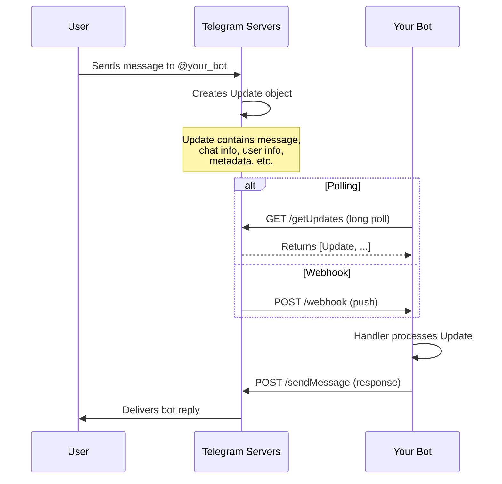
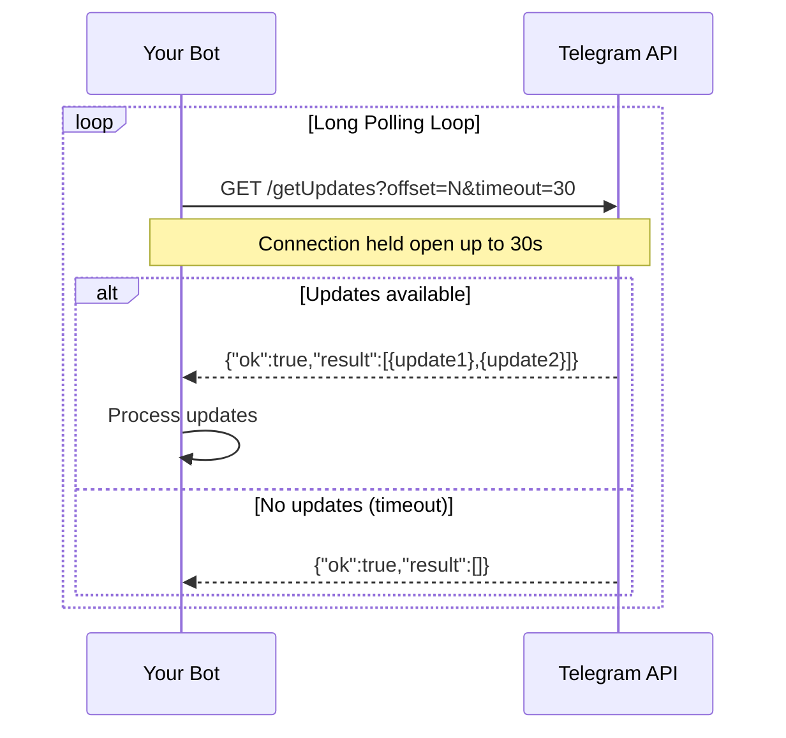
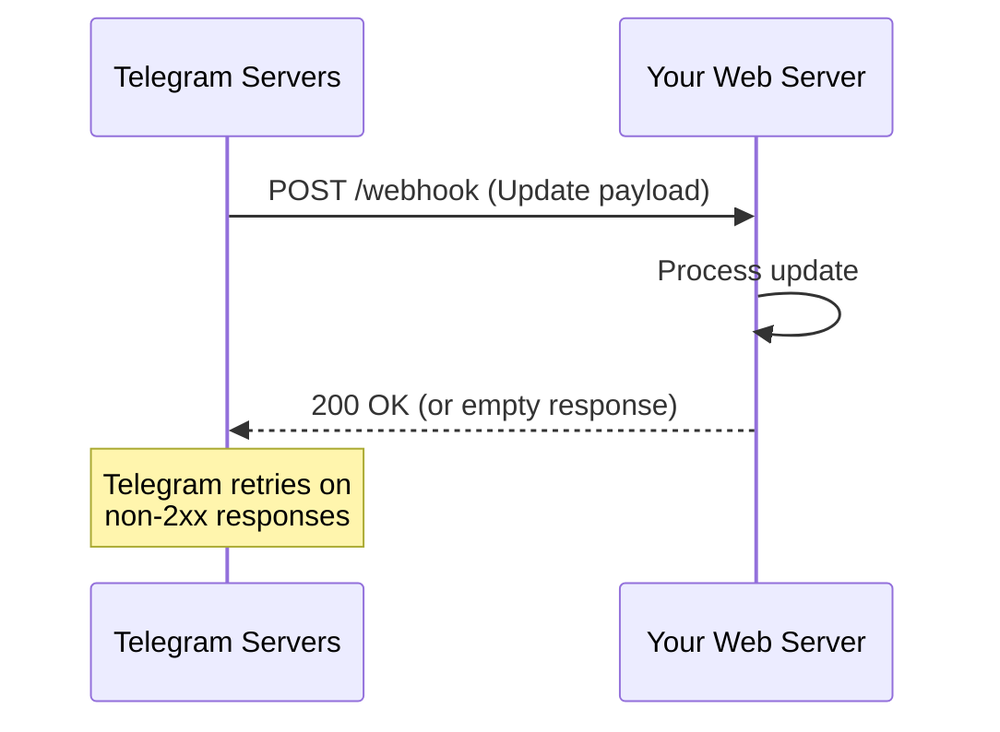

# Chapter 1: Telegram Bot Architecture

Understanding the architecture of Telegram's Bot API is essential for building reliable, scalable bots. This chapter covers the update cycle, token management, chat types, polling vs. webhooks, and privacy mode.

---

## How the Bot API Works

The Telegram Bot API is a **stateless HTTPS interface**. Every interaction between your bot and Telegram follows a simple pattern:

1. Your bot makes an HTTPS **POST** request to `https://api.telegram.org/bot<TOKEN>/<METHOD>`
2. Telegram processes the request and returns a **JSON** response
3. Telegram **pushes** updates (new messages, callbacks, etc.) to your bot via one of two delivery mechanisms: **polling** or **webhooks**

There is no persistent connection, no WebSocket, and no proprietary protocol. The entire API is built on standard HTTP semantics, making it accessible from virtually any environment.

---

## The Update Cycle

Every user interaction with your bot produces an **Update** object. The lifecycle of a single update follows this flow:



### Step-by-Step Breakdown

| Step | Actor | Action | Detail |
|------|-------|--------|--------|
| 1 | User | Sends a message | Types `/start`, presses a button, or sends any content |
| 2 | Telegram | Creates an Update | Wraps the message with metadata (user ID, chat ID, timestamp, etc.) |
| 3 | Telegram | Queues the Update | Stored in Telegram's servers until your bot retrieves or receives it |
| 4 | Bot | Receives the Update | Via polling (`getUpdates`) or webhook (HTTP push) |
| 5 | Bot | Routes to handler | PTB's dispatcher matches the update to the appropriate handler |
| 6 | Bot | Executes handler | Your async function processes the update and optionally sends a response |
| 7 | Bot | Sends API request | Calls `sendMessage`, `sendPhoto`, or any other Bot API method |
| 8 | Telegram | Delivers to user | The response appears in the user's chat with the bot |

---

## Bot Tokens

A **bot token** is the authentication credential for your bot. It proves that API requests originate from the legitimate bot owner.

### Format

```
123456789:ABCdefGHIjklMNOpqrSTUvwxYZ
```

The format is `<bot_id>:<secret>`, where:

- `bot_id` — a numeric identifier (the bot's Telegram user ID)
- `secret` — a 35-character alphanumeric string with hyphens and underscores

### How to Obtain a Token

1. Open Telegram and search for **[@BotFather](https://t.me/BotFather)**
2. Send the `/newbot` command
3. Provide a display name (e.g., `My Awesome Bot`)
4. Provide a unique username (must end in `bot`, e.g., `my_awesome_bot`)
5. BotFather replies with your token

### Security Implications

!!! danger "Treat your token like a password"
    A bot token grants **full control** over your bot. Anyone with the token can read messages, send messages, delete messages, and manage the bot. Never commit tokens to version control.

| Do | Don't |
|----|-------|
| Store tokens in environment variables | Hardcode tokens in source files |
| Use a `.env` file (added to `.gitignore`) | Share tokens in chat or email |
| Rotate tokens if compromised (`/revoke` in BotFather) | Push tokens to public repositories |
| Use different tokens for dev/staging/prod | Log tokens in production logs |

```python
"""Secure token loading with python-telegram-bot v21.x."""

import os
import logging
from telegram.ext import ApplicationBuilder

logging.basicConfig(
    format="%(asctime)s - %(name)s - %(levelname)s - %(message)s",
    level=logging.INFO,
)
logger = logging.getLogger(__name__)


def get_token() -> str:
    """Retrieve the bot token from environment variables."""
    token = os.environ.get("TELEGRAM_BOT_TOKEN")
    if not token:
        raise EnvironmentError(
            "TELEGRAM_BOT_TOKEN environment variable is not set. "
            "Set it before starting the bot."
        )
    return token


def main() -> None:
    """Initialize and run the bot."""
    app = ApplicationBuilder().token(get_token()).build()

    # ... register handlers here ...

    logger.info("Starting bot (polling mode)")
    app.run_polling(drop_pending_updates=True)


if __name__ == "__main__":
    main()
```

---

## BotFather Commands

BotFather is the official Telegram bot for managing your bots. Beyond creating bots, it provides a comprehensive set of commands:

| Command | Description | Example |
|---------|-------------|---------|
| `/newbot` | Create a new bot and obtain a token | — |
| `/mybots` | List all your bots with management options | — |
| `/setname` | Change the bot's display name | `Set my bot's name to "Support Bot"` |
| `/setdescription` | Set the bot's description (shown in profile) | `Set description to "24/7 customer support"` |
| `/setabouttext` | Set the short about text | `Set about text to "Type /help for commands"` |
| `/setuserpic` | Upload a profile photo for the bot | Send an image after the command |
| `/setcommands` | Define the command menu (auto-complete list) | `start - Start the bot\nhelp - Show help` |
| `/setprivacy` | Toggle Privacy Mode on/off | `/setprivacy` → select bot → Disable |
| `/setjoingroups` | Allow or disallow adding bot to groups | Allow / Disallow |
| `/setdomain` | Link a domain for Web App integration | Enter your domain |
| `/deletebot` | Permanently delete a bot | Cannot be undone |
| `/revoke` | Revoke the current token (generates a new one) | Use if token is compromised |
| `/mybots` → API Token | View or regenerate the bot's token | — |
| `/mybots` → Bot Settings | Configure payments, group privacy, etc. | — |

!!! tip "Command menu"
    Use `/setcommands` to define the auto-complete menu users see when they type `/` in the chat. This significantly improves UX:

    ```
    start - Welcome message
    help - List available commands
    settings - User preferences
    ```

---

## Chat Types

Telegram supports four distinct chat types, each with different capabilities and behaviors for bots:

| Chat Type | Description | Bot Visibility | Bot Can Send Messages | Typical Use Case |
|-----------|-------------|----------------|----------------------|------------------|
| **Private** | 1-on-1 chat between user and bot | Full access to messages | ✅ Always | Support bots, personal assistants |
| **Group** | 3+ users (default, legacy) | Limited by Privacy Mode | ✅ Always | Team coordination, shared tools |
| **Supergroup** | Enhanced group (migrated from group or created new) | Full access when Privacy Mode is disabled | ✅ Always | Communities, large groups, channels |
| **Channel** | Broadcast channel (one-to-many) | Can post and manage | ✅ As admin | News feeds, announcements, content delivery |

### Privacy Mode and Chat Visibility

By default, bots operate with **Privacy Mode** enabled. This means the bot only receives:

- Commands (messages starting with `/`)
- Replies to the bot's own messages
- Messages where the bot is @mentioned
- Service messages (member joined, group created, etc.)

In groups with Privacy Mode **disabled**, the bot receives **all messages**.

```
┌─────────────────────────────────────────────────┐
│              Privacy Mode: ON (default)          │
├─────────────────────────────────────────────────┤
│  User A: "Hello everyone"  → Bot does NOT see   │
│  User A: "/start"          → Bot SEES this       │
│  User A: "@bot_name hi"    → Bot SEES this       │
│  User B: replies to bot    → Bot SEES this       │
└─────────────────────────────────────────────────┘

┌─────────────────────────────────────────────────┐
│              Privacy Mode: OFF                   │
├─────────────────────────────────────────────────┤
│  User A: "Hello everyone"  → Bot SEES this       │
│  User A: "/start"          → Bot SEES this       │
│  User A: "@bot_name hi"    → Bot SEES this       │
│  User B: replies to bot    → Bot SEES this       │
└─────────────────────────────────────────────────┘
```

---

## The Update Object

An **Update** is the fundamental unit of data in the Bot API. Each Update wraps exactly one event. The `Update` object contains mutually exclusive fields — only one will be non-`None` per update:

| Field | Type | Description |
|-------|------|-------------|
| `update_id` | `int` | Unique identifier for this update |
| `message` | `Message` | A new incoming message (any type) |
| `edited_message` | `Message` | A message that was edited |
| `channel_post` | `Message` | A new post in a channel |
| `edited_channel_post` | `Message` | An edited post in a channel |
| `business_connection` | `BusinessConnection` | A business connection was established |
| `business_message` | `Message` | A new message in a business chat |
| `edited_business_message` | `Message` | An edited message in a business chat |
| `deleted_business_messages` | `BusinessMessagesDeleted` | Messages deleted in a business chat |
| `inline_query` | `InlineQuery` | An inline query from a user |
| `chosen_inline_result` | `ChosenInlineResult` | User selected an inline query result |
| `shipping_query` | `ShippingQuery` | User changed shipping address during payment |
| `pre_checkout_query` | `PreCheckoutQuery` | Bot confirmed readiness for checkout |
| `purchased_paid_media` | `PaidMediaPurchased` | User purchased paid media |
| `poll` | `Poll` | A poll was updated (created, voted, closed) |
| `poll_answer` | `PollAnswer` | User changed their answer in a poll |
| `my_chat_member` | `ChatMemberUpdated` | Bot's own status in a chat changed |
| `chat_member` | `ChatMemberUpdated` | A chat member's status changed |
| `chat_join_request` | `ChatJoinRequest` | A user requested to join a chat |
| `message_reaction` | `MessageReactionUpdated` | Reactions on a message changed |
| `message_reaction_count` | `MessageReactionCountUpdated` | Reaction counts changed |
| `chat_boost` | `ChatBoostAdded` | A chat was boosted |
| `removed_chat_boost` | `RemovedChatBoost` | A boost was removed |
| `background` | `Background` | A background was changed in the bot's chat |
| `background` | `Background` | A background was changed in the bot's chat |

!!! note "Update ordering"
    Updates are delivered in the order they occur, but the `update_id` is monotonically increasing. Your bot should track the last processed `update_id` to avoid reprocessing after a restart.

---

## Polling vs. Webhooks

Telegram provides two mechanisms for delivering updates to your bot. The choice affects architecture, deployment, and performance.

### Polling (getUpdates)

Your bot repeatedly calls the `getUpdates` API method to fetch new updates from Telegram's servers.



### Webhooks

Telegram pushes updates directly to your bot's HTTPS endpoint.



### Comparison

| Aspect | Polling | Webhooks |
|--------|---------|----------|
| **Direction** | Bot pulls from Telegram | Telegram pushes to bot |
| **Connection** | Outbound from bot | Inbound to bot's server |
| **Infrastructure** | No public IP needed | Requires public HTTPS endpoint |
| **Latency** | Depends on polling interval | Near-instant delivery |
| **Resource usage** | Higher (repeated requests) | Lower (event-driven) |
| **Complexity** | Simple to implement | Requires TLS, reverse proxy, port management |
| **Development** | ✅ Ideal for local development | ✅ Ideal for production |
| **Scaling** | Horizontal (multiple polling instances) | Single endpoint (requires load balancing) |
| **Firewall** | ✅ Works behind NAT/firewall | ❌ Requires open inbound ports |
| **Rate limits** | 30 concurrent connections, 100 updates/second | 30 concurrent connections, 100 updates/second |
| **Max timeout** | 30 seconds (long polling) | N/A (instant push) |

!!! warning "Never use both simultaneously"
    Running polling and webhook on the same bot token simultaneously causes race conditions and duplicate message processing. Choose one mechanism per token.

---

## Long Polling Explained

Standard polling (`getUpdates` with a short or zero timeout) is inefficient — it generates a new HTTP request every few seconds regardless of whether updates exist. **Long polling** solves this by telling Telegram to hold the connection open until updates arrive (or a timeout is reached).

### How It Works

```
GET /getUpdates?offset=-1&timeout=30
```

| Parameter | Purpose |
|-----------|---------|
| `offset` | The `update_id` of the first update to return. Use `-1` or the last `update_id + 1` to avoid duplicates |
| `timeout` | Maximum seconds Telegram holds the connection open (1–30). Defaults to `0` (instant response) |
| `allowed_updates` | JSON array of update types to receive (e.g., `["message","callback_query"]`). Reduces unnecessary data |

### PTB's Long Polling

`python-telegram-bot` handles long polling automatically. When you call `app.run_polling()`, it:

1. Starts a background task that calls `getUpdates` in a loop
2. Uses `timeout=30` by default (configurable)
3. Tracks the `offset` to avoid reprocessing
4. Retries on network errors with exponential backoff
5. Gracefully shuts down on SIGINT/SIGTERM

```python
"""Production-ready polling configuration."""

import logging
from telegram.ext import ApplicationBuilder

logging.basicConfig(
    format="%(asctime)s - %(name)s - %(levelname)s - %(message)s",
    level=logging.INFO,
)
logger = logging.getLogger(__name__)


def main() -> None:
    """Configure and start the bot with optimized polling."""
    app = ApplicationBuilder().token("YOUR_TOKEN_HERE").build()

    # ... register handlers ...

    app.run_polling(
        drop_pending_updates=True,  # Ignore updates from downtime
        poll_interval=2.0,  # Seconds between polls
        read_timeout=10,  # Network read timeout
        connect_timeout=10,  # Connection timeout
        allowed_updates=[  # Only receive what you handle
            "message",
            "callback_query",
            "inline_query",
            "my_chat_member",
        ],
    )


if __name__ == "__main__":
    main()
```

---

## Webhook Setup

Webhooks are the recommended approach for production deployments where low latency and efficient resource usage are critical.

### Requirements

| Requirement | Detail |
|-------------|--------|
| **HTTPS** | Telegram only sends webhooks to HTTPS endpoints (self-signed or Let's Encrypt) |
| **Public URL** | The webhook URL must be reachable from Telegram's servers |
| **Valid certificate** | TLS certificate must be valid (not expired, trusted CA or self-signed) |
| **Port** | Telegram supports ports **443**, **80**, **88**, **8443** |
| **Response time** | Must respond within ~30 seconds or Telegram retries |

### Supported Ports

| Port | Use Case |
|------|----------|
| **443** | Standard HTTPS — recommended for production |
| **80** | HTTP fallback — less common, not recommended |
| **88** | Alternative HTTPS — useful when 443 is occupied |
| **8443** | Alternative HTTPS — useful when 443 is occupied |

### Secret Token Validation

Telegram supports a `secret_token` parameter when setting a webhook. This token is included as `X-Telegram-Bot-Api-Secret-Token` in the webhook request header, allowing you to verify that incoming requests originate from Telegram.

```python
"""Webhook setup with secret token validation."""

import logging
from telegram import Update
from telegram.ext import ApplicationBuilder

logging.basicConfig(
    format="%(asctime)s - %(name)s - %(levelname)s - %(message)s",
    level=logging.INFO,
)
logger = logging.getLogger(__name__)

WEBHOOK_URL = "https://yourdomain.com/webhook"
SECRET_TOKEN = "your-secret-token-here"


async def post_init(application) -> None:
    """Set the webhook after application initialization."""
    await application.bot.set_webhook(
        url=WEBHOOK_URL,
        secret_token=SECRET_TOKEN,
        allowed_updates=[
            "message",
            "callback_query",
            "inline_query",
        ],
        drop_pending_updates=True,
    )
    logger.info("Webhook set to %s", WEBHOOK_URL)


async def pre_shutdown(application) -> None:
    """Remove the webhook before shutting down."""
    await application.bot.delete_webhook()
    logger.info("Webhook removed")


def main() -> None:
    """Start the bot in webhook mode."""
    app = (
        ApplicationBuilder()
        .token("YOUR_TOKEN_HERE")
        .post_init(post_init)
        .post_shutdown(pre_shutdown)
        .build()
    )

    # ... register handlers ...

    app.run_webhook(
        listen="0.0.0.0",
        port=8443,
        url_path="webhook",
        webhook_url=WEBHOOK_URL,
        secret_token=SECRET_TOKEN,
    )


if __name__ == "__main__":
    main()
```

### Self-Signed Certificates

For development or environments without a public CA-signed certificate, you can upload a self-signed certificate to Telegram:

```python
"""Upload a self-signed certificate for webhook registration."""

import asyncio
from telegram import Bot

BOT_TOKEN = "YOUR_TOKEN_HERE"
CERTIFICATE_PATH = "cert.pem"


async def upload_certificate() -> None:
    """Upload a self-signed certificate to Telegram."""
    bot = Bot(token=BOT_TOKEN)

    with open(CERTIFICATE_PATH, "rb") as cert_file:
        await bot.set_webhook(
            url="https://your-server:8443/webhook",
            certificate=cert_file,
        )
    print("Self-signed certificate uploaded successfully.")


if __name__ == "__main__":
    asyncio.run(upload_certificate())
```

!!! tip "Let's Encrypt"
    For production, use [Let's Encrypt](https://letsencrypt.org/) to obtain a free, trusted certificate. This eliminates the need to upload self-signed certificates to Telegram.

---

## Local Bot API Server

Telegram provides an [open-source Bot API server](https://github.com/tdlib/telegram-bot-api) that you can run locally or on your own infrastructure. This is useful when you need capabilities not available through the hosted API.

### When to Use It

| Scenario | Benefit |
|----------|---------|
| **Large file transfers** | Upload files up to **2 GB** (vs. 50 MB via hosted API) |
| **Custom HTTP endpoints** | Receive updates via regular HTTP (not just webhooks) |
| **Higher rate limits** | Increased throughput for high-volume bots |
| **Full data control** | All traffic stays on your infrastructure |
| **No external dependency** | Operate in air-gapped or restricted networks |

### Setup Overview

```bash
# Clone and build the local Bot API server
git clone https://github.com/tdlib/telegram-bot-api.git
cd telegram-bot-api
mkdir build && cd build
cmake -DCMAKE_BUILD_TYPE=Release ..
cmake --build . --target telegram-bot-api -- -j4

# Run the server
./telegram-bot-api \
    --local \
    --api-id=YOUR_API_ID \
    --api-hash=YOUR_API_HASH \
    --http-port=8081 \
    --http-ip-address=0.0.0.0
```

!!! note "API credentials"
    The Local Bot API Server requires **api_id** and **api_hash** from [my.telegram.org](https://my.telegram.org). These are different from your bot token.

### Connecting PTB to the Local Server

```python
"""Connect to a Local Bot API Server."""

import httpx
from telegram.ext import ApplicationBuilder


def main() -> None:
    """Start the bot using a local Bot API server."""
    app = (
        ApplicationBuilder()
        .token("YOUR_TOKEN_HERE")
        .base_url("http://localhost:8081/bot")  # Point to local server
        .base_file_url("http://localhost:8081/file/bot")
        .build()
    )

    # ... register handlers ...
    app.run_polling()


if __name__ == "__main__":
    main()
```

---

## Privacy Mode

**Privacy Mode** controls whether your bot can see all messages in a group or only those directed at it.

### How It Works

| Privacy Mode | What the Bot Sees in Groups |
|--------------|------------------------------|
| **ON** (default) | Commands (`/start`), replies to the bot, @mentions, service messages |
| **OFF** | **All messages** in the group, regardless of content |

### Disabling Privacy Mode

1. Open a chat with **@BotFather**
2. Send `/setprivacy`
3. Select your bot
4. Choose **Disable**

After disabling, your bot will receive every message in groups where it has permission to read messages (requires admin rights or the group's default message visibility).

### When to Disable Privacy Mode

- **Logging bots** that need to record all group activity
- **Moderation bots** that scan for spam, profanity, or policy violations
- **Analytics bots** that track group engagement and sentiment
- **AI bots** that respond to natural language without explicit commands

### When to Keep Privacy Mode ON

- **Command-only bots** that only respond to `/commands`
- **Notification bots** that relay specific mentions
- **Bots in sensitive groups** where privacy is paramount

### Configuring in PTB

PTB respects Privacy Mode automatically. In groups where the bot only sees commands, PTB will only deliver command-type updates to your handlers. To filter updates based on privacy mode in code:

```python
"""Example: Check if a message was directed at the bot."""

import logging
from telegram import Update
from telegram.ext import (
    ApplicationBuilder,
    MessageHandler,
    ContextTypes,
    filters,
)

logging.basicConfig(
    format="%(asctime)s - %(name)s - %(levelname)s - %(message)s",
    level=logging.INFO,
)
logger = logging.getLogger(__name__)


async def handle_mention(update: Update, context: ContextTypes.DEFAULT_TYPE) -> None:
    """Respond only to messages that mention the bot."""
    message = update.effective_message
    if not message:
        return

    bot_username = context.bot.username
    text = message.text or ""

    # Check if the bot was @mentioned
    if f"@{bot_username}" in text:
        await message.reply_text("You called?")
        logger.info(
            "Bot mentioned by %s in chat %s",
            update.effective_user.id,
            update.effective_chat.id,
        )


def main() -> None:
    """Start the bot."""
    app = ApplicationBuilder().token("YOUR_TOKEN_HERE").build()

    # Handle messages that mention the bot
    app.add_handler(
        MessageHandler(filters.Entity("mention") & ~filters.COMMAND, handle_mention)
    )

    app.run_polling(drop_pending_updates=True)


if __name__ == "__main__":
    main()
```

---

## Summary

| Concept | Key Takeaway |
|---------|--------------|
| **Bot API** | HTTP-based JSON interface — no proprietary protocols |
| **Update cycle** | User → Telegram → Bot (polling/webhook) → Bot → Telegram → User |
| **Bot token** | Your bot's password — keep it secret, use environment variables |
| **Chat types** | Private, Group, Supergroup, Channel — each with different bot permissions |
| **Polling** | Simple, works everywhere, ideal for development |
| **Webhooks** | Efficient, low latency, ideal for production |
| **Long polling** | Hold connection open to reduce wasted requests |
| **Privacy Mode** | ON = bot sees only commands; OFF = bot sees everything |
| **Local Bot API** | For large files, custom HTTP, or full data control |

---

## Next Steps

Proceed to [Chapter 2: Setup & Installation](02-setup.md) to install `python-telegram-bot`, create your first bot, and set up a production-ready project structure.
