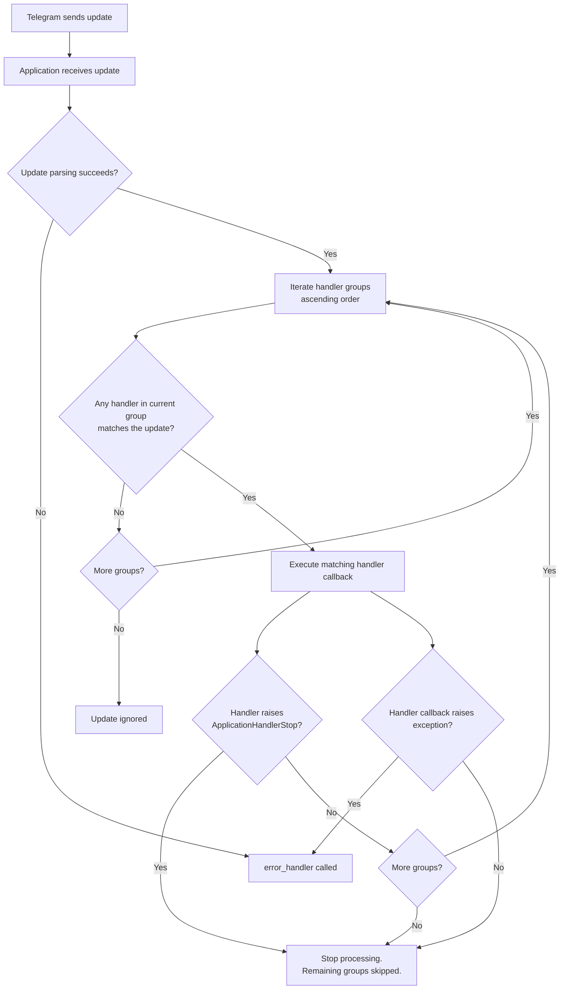

# Chapter 4: Handlers

Handlers are the backbone of every python-telegram-bot application. They define **what happens** when Telegram sends an update to your bot. This chapter covers every handler type, registration strategies, priority systems, and production patterns.

---

## Table of Contents

- [The Application Object](#the-application-object)
- [Handler Groups and Priority](#handler-groups-and-priority)
- [Handler Nesting](#handler-nesting)
- [CommandHandler](#commandhandler)
- [MessageHandler](#messagehandler)
- [CallbackQueryHandler](#callbackqueryhandler)
- [InlineQueryHandler](#inlinequeryhandler)
- [ChosenInlineResultHandler](#choseninlineresulthandler)
- [PreCheckoutQueryHandler & ShippingQueryHandler](#precheckoutqueryhandler--shippingqueryhandler)
- [PollAnswerHandler & PollHandler](#pollanswerhandler--pollhandler)
- [ChatMemberHandler](#chatmemberhandler)
- [ChatJoinRequestHandler](#chatjoinrequesthandler)
- [MessageReactionHandler](#messagereactionhandler)
- [ErrorHandler](#error-handler)
- [Handler Flow](#handler-flow)
- [Complete Example](#complete-example)

---

## The Application Object

The `Application` object is the central orchestrator. It owns the bot instance, the update queue, all registered handlers, and the job/conversation infrastructure. You never instantiate it directly — use the builder.

### `Application.builder()` Pattern

```python
import logging
from telegram.ext import ApplicationBuilder, CommandHandler, MessageHandler, filters

logging.basicConfig(
    format="%(asctime)s - %(name)s - %(levelname)s - %(message)s",
    level=logging.INFO,
)
logger = logging.getLogger(__name__)

application = ApplicationBuilder().token("YOUR_BOT_TOKEN").build()
```

The builder exposes a fluent API. Every setter returns the builder itself, so calls chain cleanly. Common builder methods:

| Method | Purpose |
|---|---|
| `.token(token)` | Set the bot token (required) |
| `.base_url(url)` | Override the Telegram API base URL |
| `.base_file_url(url)` | Override the file download base URL |
| `.get_updates_connection_pool_size(n)` | Connection pool for `getUpdates` |
| `.read_timeout(seconds)` | Read timeout for HTTP requests |
| `.write_timeout(seconds)` | Write timeout for HTTP requests |
| `.connect_timeout(seconds)` | Connect timeout for HTTP requests |
| `.pool_timeout(seconds)` | Pool timeout |
| `.bot(bot)` | Pass a pre-built `Bot` instance |
| `.update_queue(queue)` | Pass a custom `asyncio.Queue` |
| `.persistence(persistence)` | Attach a persistence backend |
| `.defaults(defaults)` | Set default parse mode, link preview, etc. |
| `.job_queue(job_queue)` | Pass a custom `JobQueue` |
| `.post_init(coroutine)` | Coroutine called after initialization |
| `.post_shutdown(coroutine)` | Coroutine called after shutdown |
| `.post_stop(coroutine)` | Coroutine called after stop |

### Adding Handlers with `add_handler()`

```python
from telegram.ext import CommandHandler

application.add_handler(CommandHandler("start", start_callback))
```

`add_handler()` accepts an optional `group` parameter (default `0`) that determines the handler's priority group. More on this below.

### Removing Handlers

```python
handler = CommandHandler("start", start_callback)
application.add_handler(handler)

# Later, remove it
application.remove_handler(handler)
```

> [!TIP]
> Store handler references if you plan to remove or replace them at runtime. There is no name-based removal API.

---

## Handler Groups and Priority

Handlers are organized into **integer-numbered groups**. When an update arrives, the application iterates through groups in ascending order (group 0, then group 1, then group 2, …). Within each group, handlers are checked in the order they were added. **The first matching handler wins** — but only within that group. If any handler in a group handles the update (i.e., its callback does not raise `ApplicationHandlerStop`), subsequent groups are **skipped**.

```python
# Group 0: general handlers (checked first)
application.add_handler(CommandHandler("start", start_cmd), group=0)

# Group 1: fallback / catch-all (checked only if group 0 didn't stop)
application.add_handler(MessageHandler(filters.ALL, fallback), group=1)
```

### Key Rules

| Rule | Detail |
|---|---|
| Lower group number = higher priority | Group 0 is checked before group 1 |
| First handler in a group wins | Registration order matters within a group |
| `ApplicationHandlerStop` stops propagation | Raising it in a callback prevents subsequent groups from running |
| Default group is `0` | Omitting `group` places the handler in group 0 |

```python
from telegram.ext import ApplicationHandlerStop


async def privileged_handler(update, context):
    if is_spam(update):
        await update.message.delete()
        raise ApplicationHandlerStop  # Don't let other groups process this
```

---

## Handler Nesting

Certain handlers act as **containers** that manage sub-handlers. The most prominent example is `ConversationHandler`, which registers multiple handlers internally and transitions between states via `ConversationHandler.END`.

```python
from telegram.ext import ConversationHandler, CommandHandler, MessageHandler, filters

NAME, AGE = range(2)


async def start_conversation(update, context):
    await update.message.reply_text("What is your name?")
    return NAME


async def receive_name(update, context):
    context.user_data["name"] = update.message.text
    await update.message.reply_text("How old are you?")
    return AGE


async def receive_age(update, context):
    name = context.user_data["name"]
    age = update.message.text
    await update.message.reply_text(f"{name}, you are {age} years old.")
    return ConversationHandler.END


conv_handler = ConversationHandler(
    entry_points=[CommandHandler("register", start_conversation)],
    states={
        NAME: [MessageHandler(filters.TEXT & ~filters.COMMAND, receive_name)],
        AGE: [MessageHandler(filters.TEXT & ~filters.COMMAND, receive_age)],
    },
    fallbacks=[CommandHandler("cancel", cancel)],
)

application.add_handler(conv_handler)
```

> [!IMPORTANT]
> `ConversationHandler` is itself a handler. It goes in a group just like any other handler. Do not add individual state handlers to the application directly — they belong inside the `ConversationHandler`.

---

## CommandHandler

`CommandHandler` responds to messages that start with `/command`. It is the most commonly used handler.

### Basic Usage

```python
from telegram import Update
from telegram.ext import CommandHandler, ContextTypes


async def start(update: Update, context: ContextTypes.DEFAULT_TYPE) -> None:
    """Send a welcome message when the command /start is issued."""
    user = update.effective_user
    await update.message.reply_html(
        rf"Hello {user.mention_html()}! I am your bot.",
    )


application.add_handler(CommandHandler("start", start))
```

### Commands with Arguments

Arguments after the command are available in `context.args` as a list of strings:

```python
import logging
from telegram import Update
from telegram.ext import CommandHandler, ContextTypes

logger = logging.getLogger(__name__)


async def greet(update: Update, context: ContextTypes.DEFAULT_TYPE) -> None:
    """Greet a user by name: /greet Alice"""
    if not context.args:
        await update.message.reply_text("Usage: /greet <name>")
        return

    name = " ".join(context.args)
    await update.message.reply_text(f"Hello, {name}!")


application.add_handler(CommandHandler("greet", greet))
```

### Command Registration Patterns

For large bots, register commands in a dedicated setup function:

```python
from telegram.ext import Application


def register_commands(application: Application) -> None:
    """Register all command handlers."""
    handlers = [
        CommandHandler("start", start),
        CommandHandler("help", help_cmd),
        CommandHandler("settings", settings),
        CommandHandler("greet", greet),
        CommandHandler("cancel", cancel),
    ]
    for handler in handlers:
        application.add_handler(handler)
```

### Bot Commands Menu

Use `set_my_commands` to push a command list to Telegram's UI (`/` menu in chats):

```python
from telegram import BotCommand


async def post_init(application: Application) -> None:
    commands = [
        BotCommand("start", "Start the bot"),
        BotCommand("help", "Show help"),
        BotCommand("settings", "Open settings"),
        BotCommand("cancel", "Cancel current operation"),
    ]
    await application.bot.set_my_commands(commands)


application = ApplicationBuilder().token("YOUR_BOT_TOKEN").post_init(post_init).build()
```

> [!NOTE]
> `post_init` runs after the bot is initialized but before polling starts. It is the correct place for one-time API calls like `set_my_commands`.

### Localized Command Menus

Set per-language command lists:

```python
from telegram import BotCommand

await application.bot.set_my_commands(
    commands=[
        BotCommand("start", "Start the bot"),
        BotCommand("help", "Show help"),
    ],
    language_code="en",
)

await application.bot.set_my_commands(
    commands=[
        BotCommand("start", "Iniciar el bot"),
        BotCommand("help", "Mostrar ayuda"),
    ],
    language_code="es",
)
```

### Ephemeral Commands

As of v20.2, you can pass `block` and other kwargs. For one-off commands you may prefer `application handlers` dynamically:

```python
# Add a temporary handler
temp = CommandHandler("flash", flash_callback)
application.add_handler(temp)

# Remove it later
application.remove_handler(temp)
```

---

## MessageHandler

`MessageHandler` matches non-command messages based on a **filter**. It is the workhorse for text replies, media processing, and catch-all logic.

### Basic Usage with Filters

```python
from telegram import Update
from telegram.ext import MessageHandler, ContextTypes, filters


async def echo(update: Update, context: ContextTypes.DEFAULT_TYPE) -> None:
    """Echo the user's text message."""
    await update.message.reply_text(update.message.text)


application.add_handler(MessageHandler(filters.TEXT & ~filters.COMMAND, echo))
```

### Processing Media

```python
async def handle_photo(update: Update, context: ContextTypes.DEFAULT_TYPE) -> None:
    """Handle incoming photos."""
    photo = update.message.photo[-1]  # Highest resolution
    file = await photo.get_file()
    await file.download_to_drive(f"photos/{photo.file_id}.jpg")
    await update.message.reply_text("Photo saved!")


application.add_handler(MessageHandler(filters.PHOTO, handle_photo))
```

### Filter Combinations

Combine filters with `&` (AND), `|` (OR), and `~` (NOT):

```python
# Text that is not a command
filters.TEXT & ~filters.COMMAND

# Photos or videos in private chats
(filters.PHOTO | filters.VIDEO) & filters.ChatType.PRIVATE

# Documents that are not images
filters.Document.ALL & ~filters.Document.IMAGE
```

---

## CallbackQueryHandler

Handles presses on inline keyboard buttons and other callback queries. **You must always answer callback queries** — otherwise the client shows a loading spinner indefinitely.

### Basic Usage

```python
from telegram import Update
from telegram.ext import CallbackQueryHandler, ContextTypes


async def button_callback(update: Update, context: ContextTypes.DEFAULT_TYPE) -> None:
    """Handle an inline keyboard button press."""
    query = update.callback_query
    await query.answer()  # Acknowledge the press

    if query.data == "option_a":
        await query.edit_message_text(text="You selected option A.")
    elif query.data == "option_b":
        await query.edit_message_text(text="You selected option B.")


application.add_handler(CallbackQueryHandler(button_callback))
```

### Using `pattern` for Filtering

The `pattern` parameter accepts a regex that is matched against `callback_data`:

```python
from telegram.ext import CallbackQueryHandler

# Match exactly "delete_123"
application.add_handler(CallbackQueryHandler(confirm_delete, pattern=r"^delete_\d+$"))

# Match using a compiled regex
import re

application.add_handler(
    CallbackQueryHandler(confirm_delete, pattern=re.compile(r"^delete_(?P<id>\d+)$"))
)
```

When `pattern` is a compiled regex with named groups, the match object is available in `context.match`.

### Answering with Feedback

```python
await query.answer(text="Saved!", show_alert=False)  # Toast notification
await query.answer(text="Are you sure?", show_alert=True)  # Modal alert
```

### Editing Messages on Callback

```python
from telegram import InlineKeyboardButton, InlineKeyboardMarkup


async def settings(update: Update, context: ContextTypes.DEFAULT_TYPE) -> None:
    """Show settings keyboard."""
    keyboard = [
        [InlineKeyboardButton("Notifications", callback_data="settings_notifications")],
        [InlineKeyboardButton("Language", callback_data="settings_language")],
    ]
    await update.message.reply_text(
        "Settings:", reply_markup=InlineKeyboardMarkup(keyboard)
    )


async def settings_callback(update: Update, context: ContextTypes.DEFAULT_TYPE) -> None:
    query = update.callback_query
    await query.answer()

    if query.data == "settings_notifications":
        keyboard = [
            [InlineKeyboardButton("Enable", callback_data="notif_enable")],
            [InlineKeyboardButton("Disable", callback_data="notif_disable")],
            [InlineKeyboardButton("Back", callback_data="settings_back")],
        ]
        await query.edit_message_text(
            text="Notification settings:",
            reply_markup=InlineKeyboardMarkup(keyboard),
        )
```

---

## InlineQueryHandler

Handles inline queries sent by users via `@yourbot query` in any chat.

### Basic Usage

```python
from telegram import InlineQueryResultArticle, InputTextMessageContent
from telegram.ext import InlineQueryHandler, ContextTypes


async def inline_query(update: Update, context: ContextTypes.DEFAULT_TYPE) -> None:
    """Answer inline queries with article results."""
    query = update.inline_query.query
    if not query:
        return

    results = [
        InlineQueryResultArticle(
            id=query,
            title=f"Result for: {query}",
            input_message_content=InputTextMessageContent(
                message_text=f"You searched for: {query}"
            ),
            description=f"Description for {query}",
        )
    ]

    await update.inline_query.answer(results, cache_time=300, is_personal=True)
```

### Pagination with Offset

```python
import math

RESULTS_PER_PAGE = 50


async def paginated_inline(update: Update, context: ContextTypes.DEFAULT_TYPE) -> None:
    query = update.inline_query.query
    offset = int(update.inline_query.offset) if update.inline_query.offset else 0

    all_results = generate_all_results(query)  # Your data source
    total = len(all_results)
    page = all_results[offset : offset + RESULTS_PER_PAGE]

    results = [build_result(item) for item in page]

    next_offset = (
        str(offset + RESULTS_PER_PAGE) if offset + RESULTS_PER_PAGE < total else ""
    )

    await update.inline_query.answer(
        results,
        next_offset=next_offset,
        cache_time=30,
        is_personal=True,
    )
```

---

## ChosenInlineResultHandler

Fires when a user **selects** an inline result and sends it to the chat. Useful for analytics and tracking.

```python
from telegram.ext import ChosenInlineResultHandler, ContextTypes


async def chosen_result(update: Update, context: ContextTypes.DEFAULT_TYPE) -> None:
    result = update.chosen_inline_result
    logger.info(
        "User %s selected inline result %s with query '%s'",
        result.from_user.id,
        result.result_id,
        result.query,
    )


application.add_handler(ChosenInlineResultHandler(chosen_result))
```

---

## PreCheckoutQueryHandler & ShippingQueryHandler

These handlers power Telegram's built-in payment system via [Telegram Payments](https://core.telegram.org/bots/payments).

### Pre-Checkout Handler

Fires when a user confirms a payment. You **must** respond within 10 seconds.

```python
from telegram import Update, PreCheckoutQuery
from telegram.ext import PreCheckoutQueryHandler, ContextTypes


async def pre_checkout(update: Update, context: ContextTypes.DEFAULT_TYPE) -> None:
    """Answer the PreCheckoutQuery."""
    query: PreCheckoutQuery = update.pre_checkout_query

    if query.invoice_payload == "order_123":
        await query.answer(ok=True)
    else:
        await query.answer(ok=False, error_message="Something went wrong.")


application.add_handler(PreCheckoutQueryHandler(pre_checkout))
```

### Shipping Handler

Fires when a user provides a shipping address (for physical goods).

```python
from telegram import Update, ShippingOption, LabeledPrice
from telegram.ext import ShippingQueryHandler, ContextTypes


async def shipping(update: Update, context: ContextTypes.DEFAULT_TYPE) -> None:
    query = update.shipping_query
    if query.invoice_payload == "order_123":
        options = [
            ShippingOption(
                id="standard",
                title="Standard Shipping",
                prices=[LabeledPrice("Standard", 150)],
            ),
            ShippingOption(
                id="express",
                title="Express Shipping",
                prices=[LabeledPrice("Express", 400)],
            ),
        ]
        await query.answer(ok=True, shipping_options=options)
    else:
        await query.answer(ok=False, error_message="Unknown invoice.")


application.add_handler(ShippingQueryHandler(shipping))
```

> [!CAUTION]
> Failing to answer a `PreCheckoutQuery` within 10 seconds results in the payment being cancelled by Telegram. Always handle this handler even if you simply approve all payments.

---

## PollAnswerHandler & PollHandler

### PollAnswerHandler

Handles answers to polls the bot created (non-anonymous polls).

```python
from telegram import Update
from telegram.ext import PollAnswerHandler, ContextTypes


async def poll_answer(update: Update, context: ContextTypes.DEFAULT_TYPE) -> None:
    answer = update.poll_answer
    logger.info(
        "User %s answered poll %s with options %s",
        answer.user.id,
        answer.poll_id,
        answer.option_ids,
    )


application.add_handler(PollAnswerHandler(poll_answer))
```

### PollHandler

Handles updates when a poll the bot sent is updated (e.g., when a user votes).

```python
from telegram import Update
from telegram.ext import PollHandler, ContextTypes


async def poll_update(update: Update, context: ContextTypes.DEFAULT_TYPE) -> None:
    poll = update.poll
    logger.info("Poll %s updated. Total votes: %d", poll.id, poll.total_voter_count)


application.add_handler(PollHandler(poll_update))
```

---

## ChatMemberHandler

Tracks when chat members are promoted, demoted, restricted, or change their status.

```python
from telegram import Update
from telegram.ext import ChatMemberHandler, ContextTypes


async def chat_member_update(
    update: Update, context: ContextTypes.DEFAULT_TYPE
) -> None:
    result = update.chat_member
    old = result.old_chat_member
    new = result.new_chat_member

    if old.status != new.status:
        logger.info(
            "User %s status changed from %s to %s in chat %s",
            new.user.id,
            old.status,
            new.status,
            result.chat.id,
        )


application.add_handler(
    ChatMemberHandler(chat_member_update, ChatMemberHandler.CHAT_MEMBER)
)
```

### `ChatMemberHandler` Modes

| Mode | Constant | When it fires |
|---|---|---|
| Only status changes | `ChatMemberHandler.CHAT_MEMBER` | Any member's status changes |
| All updates | `ChatMemberHandler.MY_CHAT_MEMBER` | The bot's own status changes |

Use `MY_CHAT_MEMBER` to detect when the bot is added, removed, or restricted in a chat.

---

## ChatJoinRequestHandler

Fires when a user sends a join request to a group or channel with approvals enabled.

```python
from telegram import Update
from telegram.ext import ChatJoinRequestHandler, ContextTypes


async def join_request(update: Update, context: ContextTypes.DEFAULT_TYPE) -> None:
    request = update.chat_join_request
    user = request.user

    # Auto-approve (or add your own logic)
    await request.approve()
    logger.info("Approved join request from %s to chat %s", user.id, request.chat.id)


application.add_handler(ChatJoinRequestHandler(join_request))
```

To reject:

```python
await request.decline()
```

---

## MessageReactionHandler

> [!NOTE]
> Available since python-telegram-bot v20.0+. Requires bot API 11.1+.

Tracks when users add, remove, or change reactions to messages.

```python
from telegram import Update
from telegram.ext import MessageReactionHandler, ContextTypes


async def reaction_update(update: Update, context: ContextTypes.DEFAULT_TYPE) -> None:
    reaction = update.message_reaction
    logger.info(
        "Reaction update in chat %s by user %s: old=%s new=%s",
        reaction.chat.id,
        reaction.user.id,
        reaction.old_reaction,
        reaction.new_reaction,
    )


application.add_handler(MessageReactionHandler(reaction_update))
```

---

## Error Handler

The error handler catches **all unhandled exceptions** from any handler callback. It is essential for production bots.

### Registering the Error Handler

```python
from telegram import Update
from telegram.ext import ContextTypes


async def error_handler(update: object, context: ContextTypes.DEFAULT_TYPE) -> None:
    """Log the error and send a notification to the developer."""
    logger.error("Exception while handling an update:", exc_info=context.error)

    # Optionally notify the user
    if isinstance(update, Update) and update.effective_message:
        await update.effective_message.reply_text(
            "An internal error occurred. Please try again later."
        )
```

> [!WARNING]
> The error handler receives `update: object` (not `Update`) because the update may be `None` if the error occurred during parsing.

```python
application.add_error_handler(error_handler)
```

### Exception Handling Patterns

```python
import httpx
from telegram import Update
from telegram.error import Forbidden, BadRequest, TimedOut, NetworkError
from telegram.ext import ContextTypes


async def error_handler(update: object, context: ContextTypes.DEFAULT_TYPE) -> None:
    exception = context.error

    if isinstance(exception, Forbidden):
        # User blocked the bot — nothing to do
        logger.warning("User blocked the bot: %s", exception)

    elif isinstance(exception, BadRequest):
        # Malformed request
        logger.error("Bad request: %s", exception)

    elif isinstance(exception, TimedOut):
        # Transient network issue
        logger.warning("Timed out: %s", exception)

    elif isinstance(exception, NetworkError):
        # Broader network issue
        logger.error("Network error: %s", exception)

    else:
        # Unexpected error
        logger.exception("Unexpected error: %s", exception)
```

### Logging Errors with Full Context

```python
import traceback


async def error_handler(update: object, context: ContextTypes.DEFAULT_TYPE) -> None:
    tb_list = traceback.format_exception(
        None, context.error, context.error.__traceback__
    )
    tb_string = "".join(tb_list)
    logger.error(
        "Unhandled exception while processing update %s:\n%s",
        update,
        tb_string,
    )
```

---

## Handler Flow

The following diagram illustrates how an incoming update is processed:



---

## Complete Example

A production-ready bot combining multiple handlers, error handling, persistence, and logging.

```python
"""Production example: multi-handler bot with logging and error handling."""

import logging
import os
from typing import Final

from telegram import (
    BotCommand,
    InlineKeyboardButton,
    InlineKeyboardMarkup,
    Update,
)
from telegram.ext import (
    Application,
    CallbackQueryHandler,
    CommandHandler,
    ContextTypes,
    MessageHandler,
    filters,
)

BOT_TOKEN: Final[str] = os.environ["BOT_TOKEN"]
DEVELOPER_CHAT_ID: Final[int] = int(os.environ.get("DEVELOPER_CHAT_ID", "0"))

logging.basicConfig(
    format="%(asctime)s - %(name)s - %(levelname)s - %(message)s",
    level=logging.INFO,
)
logger = logging.getLogger(__name__)


# ---------------------------------------------------------------------------
# Command handlers
# ---------------------------------------------------------------------------


async def start(update: Update, context: ContextTypes.DEFAULT_TYPE) -> None:
    user = update.effective_user
    await update.message.reply_html(
        rf"Hello {user.mention_html()}! "
        r"I am your production-ready bot. Send /help for commands.",
    )


async def help_cmd(update: Update, context: ContextTypes.DEFAULT_TYPE) -> None:
    text = (
        "Available commands:\n"
        "/start - Welcome message\n"
        "/help - This help text\n"
        "/menu - Show inline menu\n"
        "/settings - User settings"
    )
    await update.message.reply_text(text)


async def menu(update: Update, context: ContextTypes.DEFAULT_TYPE) -> None:
    keyboard = [
        [InlineKeyboardButton("Option A", callback_data="opt_a")],
        [InlineKeyboardButton("Option B", callback_data="opt_b")],
    ]
    await update.message.reply_text(
        "Choose an option:", reply_markup=InlineKeyboardMarkup(keyboard)
    )


async def settings(update: Update, context: ContextTypes.DEFAULT_TYPE) -> None:
    await update.message.reply_text("Settings page coming soon.")


# ---------------------------------------------------------------------------
# Callback query handler
# ---------------------------------------------------------------------------


async def button_callback(update: Update, context: ContextTypes.DEFAULT_TYPE) -> None:
    query = update.callback_query
    await query.answer()

    responses = {
        "opt_a": "You selected Option A.",
        "opt_b": "You selected Option B.",
    }
    text = responses.get(query.data, "Unknown option.")
    await query.edit_message_text(text=text)


# ---------------------------------------------------------------------------
# Echo handler (catch-all for text)
# ---------------------------------------------------------------------------


async def echo(update: Update, context: ContextTypes.DEFAULT_TYPE) -> None:
    await update.message.reply_text(f"Echo: {update.message.text}")


# ---------------------------------------------------------------------------
# Error handler
# ---------------------------------------------------------------------------


async def error_handler(update: object, context: ContextTypes.DEFAULT_TYPE) -> None:
    logger.error("Unhandled exception:", exc_info=context.error)

    if DEVELOPER_CHAT_ID:
        await context.bot.send_message(
            chat_id=DEVELOPER_CHAT_ID,
            text=f"⚠️ Bot error: {context.error}",
        )

    if isinstance(update, Update) and update.effective_message:
        try:
            await update.effective_message.reply_text(
                "Something went wrong. Please try again later."
            )
        except Exception:
            logger.warning("Could not notify user about the error.")


# ---------------------------------------------------------------------------
# Bot commands menu
# ---------------------------------------------------------------------------


async def post_init(application: Application) -> None:
    await application.bot.set_my_commands(
        [
            BotCommand("start", "Start the bot"),
            BotCommand("help", "Show help"),
            BotCommand("menu", "Show inline menu"),
            BotCommand("settings", "Open settings"),
        ]
    )


# ---------------------------------------------------------------------------
# Main
# ---------------------------------------------------------------------------


def main() -> None:
    application = Application.builder().token(BOT_TOKEN).post_init(post_init).build()

    # Group 0 — primary handlers
    application.add_handler(CommandHandler("start", start))
    application.add_handler(CommandHandler("help", help_cmd))
    application.add_handler(CommandHandler("menu", menu))
    application.add_handler(CommandHandler("settings", settings))
    application.add_handler(CallbackQueryHandler(button_callback))

    # Group 1 — catch-all (only reached if group 0 didn't match)
    application.add_handler(MessageHandler(filters.TEXT & ~filters.COMMAND, echo))

    # Error handler (always active)
    application.add_error_handler(error_handler)

    application.run_polling(allowed_updates=Update.ALL_TYPES)


if __name__ == "__main__":
    main()
```

> [!TIP]
> Pass `allowed_updates=Update.ALL_TYPES` to `run_polling()` to receive every update type. Without this, the bot only receives messages by default.

---

## `run_polling()` vs `run_webhook()`

| Feature | `run_polling()` | `run_webhook()` |
|---|---|---|
| **Transport** | Long-polling via `getUpdates` | HTTPS webhook |
| **Best for** | Development, small bots | Production, large bots |
| **Infrastructure** | None — bot pulls updates | Requires a public HTTPS endpoint |
| **Setup complexity** | Zero | Moderate (certificate, reverse proxy, port) |
| **Latency** | Higher (polling interval) | Lower (push-based) |
| **Scaling** | Single instance | Multiple instances behind load balancer |

```python
# Polling (development / simple deployment)
application.run_polling(
    allowed_updates=Update.ALL_TYPES,
    drop_pending_updates=True,
)

# Webhook (production)
application.run_webhook(
    listen="0.0.0.0",
    port=8443,
    url_path="BOT_TOKEN",
    webhook_url="https://yourdomain.com:8443/BOT_TOKEN",
    cert="cert.pem",
    key="key.pem",
)
```

> [!NOTE]
> `drop_pending_updates=True` tells the bot to ignore updates that arrived while it was offline. This prevents a flood of old updates on restart.

---

## Summary

| Handler | Purpose | Key Requirement |
|---|---|---|
| `CommandHandler` | `/command` messages | Command name string |
| `MessageHandler` | Non-command messages/media | Filter object |
| `CallbackQueryHandler` | Inline keyboard presses | `query.answer()` required |
| `InlineQueryHandler` | `@bot query` inline | `answer()` with results |
| `ChosenInlineResultHandler` | Inline result selection | Analytics use |
| `PreCheckoutQueryHandler` | Payment confirmation | 10s response deadline |
| `ShippingQueryHandler` | Shipping address | For physical goods |
| `PollAnswerHandler` | Poll vote | Non-anonymous polls |
| `PollHandler` | Poll update | Bot-created polls |
| `ChatMemberHandler` | Member status changes | Permission required |
| `ChatJoinRequestHandler` | Join requests | Approve/decline |
| `MessageReactionHandler` | Reaction changes | API 11.1+ |

Handlers are the entry points to your bot's logic. Combined with the filter system (Chapter 5) and the conversation system (Chapter 6), they enable building complex, reliable Telegram bots.
