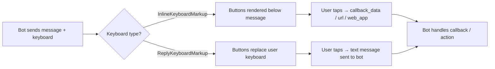
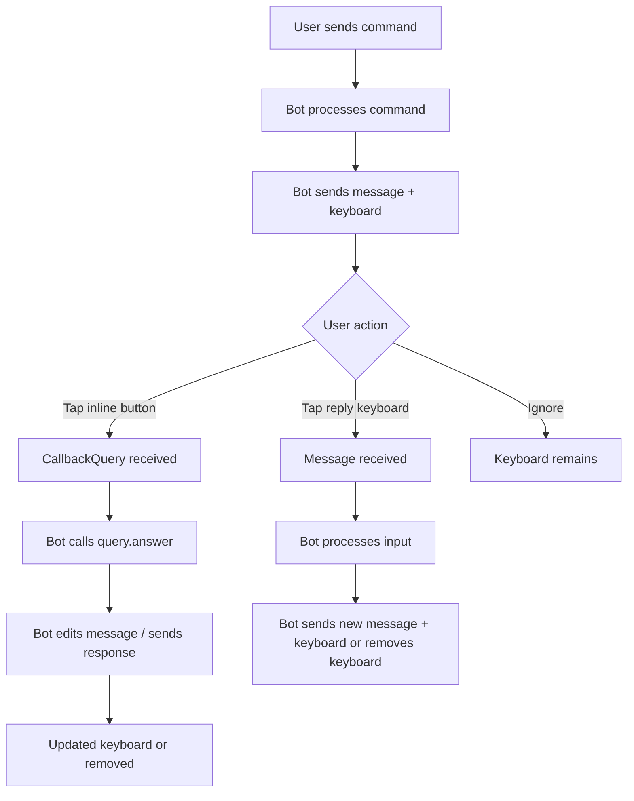
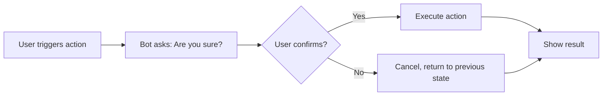

# Chapter 6: Keyboards & Inline Buttons

## Overview

Telegram bots interact with users through two distinct keyboard systems:

| System | Appearance | Attached To | Use Case |
|--------|-----------|-------------|----------|
| **Inline Keyboards** | Buttons rendered directly below a message | A specific message | Acting on message content (voting, editing, navigation) |
| **Reply Keyboards** | Replaces the user's native keyboard area | The chat itself | Collecting structured input (location, contact, choices) |

**When to use each:**

- **Inline Keyboards** — when the action is *contextual to a message*: confirming an order, navigating paginated results, toggling settings, or launching a Mini App from specific content.
- **Reply Keyboards** — when you need the user to provide *structured input* via the keyboard area: sharing a location, selecting from a list of options that should persist across messages, or forcing a reply to a specific prompt.

> [!TIP]
> Inline keyboards and reply keyboards can be used together. A common pattern is a reply keyboard for input collection paired with inline keyboards for message-specific actions.



---

## Inline Keyboards

Inline keyboards are buttons attached to a specific message. They support a wide range of actions beyond simple text replies.

### InlineKeyboardButton — All Fields

Every button in an inline keyboard is an `InlineKeyboardButton` instance. Only one action field should be set per button.

| Field | Type | Description |
|-------|------|-------------|
| `text` | `str` | **Required.** Button label (1–64 characters). Supports emoji. |
| `url` | `str` | Opens the given URL in the user's browser on tap. |
| `callback_data` | `str` | 1–64 bytes of data sent back to the bot via `CallbackQuery`. |
| `web_app` | `WebAppInfo` | Launches a Telegram Mini App (TWA). |
| `login_url` | `LoginUrl` | Auto-authorizes the user via Telegram Login Widget, then redirects to a URL. |
| `switch_inline_query` | `str` | Switches to inline mode with the given query pre-filled. |
| `switch_inline_query_current_chat` | `str` | Same as above, but scoped to the current chat. |
| `switch_inline_query_chosen_chat` | `SwitchInlineQueryChosenChat` | Prompts the user to pick a chat before switching to inline mode. |
| `copy_text` | `CopyTextButton` | Copies the specified text to the user's clipboard on tap. |
| `callback_game` | `CallbackGame` | Launches the bot's game (must be set as the only button). |
| `pay` | `bool` | Payment button. Must be the first button in a keyboard containing exactly one button. |

> [!IMPORTANT]
> The `text` field is always required. All other fields are mutually exclusive action fields — set exactly one per button (except for `text` + one action).

### InlineKeyboardMarkup

`InlineKeyboardMarkup` holds a list of button rows, where each row is a list of `InlineKeyboardButton` objects.

```python
from telegram import InlineKeyboardButton, InlineKeyboardMarkup

keyboard = [
    [
        InlineKeyboardButton("Option A", callback_data="opt_a"),
        InlineKeyboardButton("Option B", callback_data="opt_b"),
    ],
    [
        InlineKeyboardButton("Visit Docs", url="https://example.com/docs"),
    ],
]
markup = InlineKeyboardMarkup(keyboard)
```

**Sending with a message:**

```python
from telegram import Update
from telegram.ext import ContextTypes


async def send_menu(update: Update, context: ContextTypes.DEFAULT_TYPE) -> None:
    keyboard = [
        [
            InlineKeyboardButton("Profile", callback_data="profile"),
            InlineKeyboardButton("Settings", callback_data="settings"),
        ],
        [InlineKeyboardButton("Help", callback_data="help")],
    ]
    await update.message.reply_text(
        "Choose an option:",
        reply_markup=InlineKeyboardMarkup(keyboard),
    )
```

**Editing an existing message's keyboard:**

```python
await callback.message.edit_reply_markup(reply_markup=new_markup)
```

> [!NOTE]
> You can only edit reply markup on messages the bot has sent. Attempting to edit user messages will raise `telegram.error.BadRequest`.

### Handling Callbacks

When a user taps an inline button, the bot receives a `CallbackQuery` object. **You must answer every callback query** — otherwise the loading spinner on the button persists indefinitely and Telegram may rate-limit your bot.

```python
from telegram import Update
from telegram.ext import CallbackQueryHandler, ContextTypes


async def handle_callback(update: Update, context: ContextTypes.DEFAULT_TYPE) -> None:
    query = update.callback_query
    await query.answer()  # Acknowledge the callback (REQUIRED)

    if query.data == "opt_a":
        await query.edit_message_text("You selected Option A.")
    elif query.data == "opt_b":
        await query.edit_message_text("You selected Option B.")
```

**Pattern matching with regex:**

```python
import re
from telegram.ext import CallbackQueryHandler


async def handle_callback(update: Update, context: ContextTypes.DEFAULT_TYPE) -> None:
    query = update.callback_query
    match = re.match(r"page_(\d+)", query.data)
    if match:
        page = int(match.group(1))
        await query.answer()
        await query.edit_message_text(f"Showing page {page}")
    else:
        await query.answer("Unknown action.", show_alert=True)


# Register with a pattern
app.add_handler(CallbackQueryHandler(handle_callback, pattern=r"^page_\d+$"))
```

**Showing alerts:**

```python
# Simple acknowledgment (no popup)
await query.answer()

# Popup alert with text
await query.answer("Action completed!", show_alert=True)

# Silently acknowledge (no toast, no alert — not recommended)
await query.answer(cache_time=0)
```

> [!WARNING]
> Always call `query.answer()` before editing the message. If `answer()` is called *after* an edit, Telegram may throw `telegram.error.BadRequest: query is too old`.

### Complete Inline Keyboard Examples

#### Navigation Menu (Multi-Page)

```python
import logging
from telegram import InlineKeyboardButton, InlineKeyboardMarkup, Update
from telegram.ext import CallbackQueryHandler, ContextTypes

logger = logging.getLogger(__name__)

ITEMS_PER_PAGE = 5
ITEMS = [f"Item {i}" for i in range(1, 26)]


def build_page_keyboard(page: int) -> InlineKeyboardMarkup:
    total_pages = (len(ITEMS) + ITEMS_PER_PAGE - 1) // ITEMS_PER_PAGE
    start = page * ITEMS_PER_PAGE
    end = start + ITEMS_PER_PAGE
    page_items = ITEMS[start:end]

    keyboard: list[list[InlineKeyboardButton]] = [
        [InlineKeyboardButton(item, callback_data=f"item_{start + i}")]
        for i, item in enumerate(page_items)
    ]

    nav_row: list[InlineKeyboardButton] = []
    if page > 0:
        nav_row.append(InlineKeyboardButton("⬅ Prev", callback_data=f"page_{page - 1}"))
    nav_row.append(
        InlineKeyboardButton(f"{page + 1}/{total_pages}", callback_data="noop")
    )
    if page < total_pages - 1:
        nav_row.append(InlineKeyboardButton("Next ➡", callback_data=f"page_{page + 1}"))
    keyboard.append(nav_row)

    return InlineKeyboardMarkup(keyboard)


async def show_list(update: Update, context: ContextTypes.DEFAULT_TYPE) -> None:
    context.user_data["page"] = 0
    await update.message.reply_text(
        "Browse items:", reply_markup=build_page_keyboard(0)
    )


async def paginate(update: Update, context: ContextTypes.DEFAULT_TYPE) -> None:
    query = update.callback_query
    await query.answer()

    page = int(query.data.split("_")[1])
    context.user_data["page"] = page
    await query.edit_message_reply_markup(reply_markup=build_page_keyboard(page))


async def select_item(update: Update, context: ContextTypes.DEFAULT_TYPE) -> None:
    query = update.callback_query
    await query.answer(f"You selected {query.data}", show_alert=True)
```

#### Settings Toggles

```python
from telegram import InlineKeyboardButton, InlineKeyboardMarkup, Update
from telegram.ext import ContextTypes


def settings_keyboard(settings: dict[str, bool]) -> InlineKeyboardMarkup:
    keyboard = [
        [
            InlineKeyboardButton(
                f"{'✅' if v else '❌'} {k}",
                callback_data=f"toggle_{k}",
            )
        ]
        for k, v in settings.items()
    ]
    keyboard.append([InlineKeyboardButton("Done", callback_data="settings_done")])
    return InlineKeyboardMarkup(keyboard)


async def settings_command(update: Update, context: ContextTypes.DEFAULT_TYPE) -> None:
    if "settings" not in context.user_data:
        context.user_data["settings"] = {
            "Notifications": True,
            "Dark Mode": False,
            "Auto-save": True,
        }
    await update.message.reply_text(
        "Settings:", reply_markup=settings_keyboard(context.user_data["settings"])
    )


async def toggle_setting(update: Update, context: ContextTypes.DEFAULT_TYPE) -> None:
    query = update.callback_query
    await query.answer()

    key = query.data.removeprefix("toggle_")
    context.user_data["settings"][key] = not context.user_data["settings"][key]
    await query.edit_message_reply_markup(
        reply_markup=settings_keyboard(context.user_data["settings"])
    )


async def settings_done(update: Update, context: ContextTypes.DEFAULT_TYPE) -> None:
    query = update.callback_query
    await query.answer("Settings saved!")
    await query.edit_message_text("Settings saved. ✅")
```

#### Confirmation Dialog

```python
from telegram import InlineKeyboardButton, InlineKeyboardMarkup, Update
from telegram.ext import ContextTypes


async def confirm_action(update: Update, context: ContextTypes.DEFAULT_TYPE) -> None:
    keyboard = [
        [
            InlineKeyboardButton("Yes, delete", callback_data="confirm_yes"),
            InlineKeyboardButton("No, cancel", callback_data="confirm_no"),
        ]
    ]
    await update.message.reply_text(
        "Are you sure you want to delete this item?",
        reply_markup=InlineKeyboardMarkup(keyboard),
    )


async def handle_confirmation(
    update: Update, context: ContextTypes.DEFAULT_TYPE
) -> None:
    query = update.callback_query
    await query.answer()

    if query.data == "confirm_yes":
        await query.edit_message_text("Item deleted.")
        logger.info("Item deleted by user %s", query.from_user.id)
    else:
        await query.edit_message_text("Deletion cancelled.")
```

#### Copy Text Button

```python
from telegram import CopyTextButton, InlineKeyboardButton, InlineKeyboardMarkup, Update
from telegram.ext import ContextTypes


async def share_code(update: Update, context: ContextTypes.DEFAULT_TYPE) -> None:
    code = "pip install python-telegram-bot"
    keyboard = [
        [
            InlineKeyboardButton(
                "📋 Copy Install Command", copy_text=CopyTextButton(text=code)
            )
        ]
    ]
    await update.message.reply_text(
        f"Install command:\n\n`{code}`",
        parse_mode="Markdown",
        reply_markup=InlineKeyboardMarkup(keyboard),
    )
```

---

## Reply Keyboards

Reply keyboards modify the user's native keyboard area. Unlike inline keyboards, they are not attached to a specific message and persist until removed.

### ReplyKeyboardMarkup

```python
from telegram import ReplyKeyboardMarkup, KeyboardButton, Update
from telegram.ext import ContextTypes


async def start(update: Update, context: ContextTypes.DEFAULT_TYPE) -> None:
    keyboard = [
        [KeyboardButton("Share Location", request_location=True)],
        [KeyboardButton("Share Contact", request_contact=True)],
        [KeyboardButton("Menu")],
    ]
    await update.message.reply_text(
        "Use the keyboard below:",
        reply_markup=ReplyKeyboardMarkup(
            keyboard,
            resize_keyboard=True,
            one_time_keyboard=False,
            input_field_placeholder="Type a command or use the keyboard…",
        ),
    )
```

**Key parameters:**

| Parameter | Type | Default | Description |
|-----------|------|---------|-------------|
| `keyboard` | `list[list[KeyboardButton]]` | — | **Required.** 2D list of button rows. |
| `resize_keyboard` | `bool` | `False` | Shrink keyboard to fit. **Always set to `True`** for better UX — default keyboards take up ~40% of screen height. |
| `one_time_keyboard` | `bool` | `False` | Hide keyboard after one button press. Useful for one-shot selections. |
| `input_field_placeholder` | `str` | `""` | Hint text in the input field while the keyboard is active. Max 64 characters. |
| `selective` | `bool` | `False` | Show keyboard only to specific users in groups (used with `reply_to_message_id`). |
| `is_persistent` | `bool` | `False` | Keep the keyboard visible even after the user sends a message. Useful for persistent navigation bars. |

> [!TIP]
> Always set `resize_keyboard=True`. The default keyboard height is excessive on most devices and degrades the user experience.

### KeyboardButton

Each button in a reply keyboard is a `KeyboardButton`. Beyond simple text, buttons can request specific data from the user.

| Field | Type | Description |
|-------|------|-------------|
| `text` | `str` | **Required.** Button label. |
| `request_users` | `KeyboardButtonRequestUsers` | Opens a UI for the user to select one or more users. |
| `request_chat` | `KeyboardButtonRequestChat` | Opens a UI for the user to select a chat. |
| `request_contact` | `bool` | Prompts the user to share their phone number. |
| `request_location` | `bool` | Prompts the user to share their location. |
| `request_poll` | `KeyboardButtonRequestPoll` | Opens the poll creation interface. |
| `web_app` | `WebAppInfo` | Launches a Mini App from the keyboard. |

**Handling shared data from keyboard buttons:**

```python
import logging
from telegram import Update
from telegram.ext import ContextTypes, MessageHandler, filters

logger = logging.getLogger(__name__)


async def handle_contact(update: Update, context: ContextTypes.DEFAULT_TYPE) -> None:
    contact = update.message.contact
    if contact:
        logger.info(
            "User %s shared phone: %s", update.effective_user.id, contact.phone_number
        )
        await update.message.reply_text(f"Thanks, {contact.first_name}!")


async def handle_location(update: Update, context: ContextTypes.DEFAULT_TYPE) -> None:
    location = update.message.location
    if location:
        logger.info(
            "User %s shared location: %.4f, %.4f",
            update.effective_user.id,
            location.latitude,
            location.longitude,
        )
        await update.message.reply_text("Location received!")
```

### ReplyKeyboardRemove

Removes the custom reply keyboard and restores the default one.

```python
from telegram import ReplyKeyboardRemove, Update
from telegram.ext import ContextTypes


async def done(update: Update, context: ContextTypes.DEFAULT_TYPE) -> None:
    await update.message.reply_text(
        "Conversation finished.",
        reply_markup=ReplyKeyboardRemove(),
    )
```

| Parameter | Type | Default | Description |
|-----------|------|---------|-------------|
| `selective` | `bool` | `False` | Remove keyboard only for a specific user in groups. |

### ForceReply

Forces the user to reply to a specific message. The user's client highlights the message and opens the reply interface automatically.

```python
from telegram import ForceReply, Update
from telegram.ext import ContextTypes


async def ask_question(update: Update, context: ContextTypes.DEFAULT_TYPE) -> None:
    await update.message.reply_text(
        "What is your name?",
        reply_markup=ForceReply(selective=False),
    )
```

| Parameter | Type | Default | Description |
|-----------|------|---------|-------------|
| `selective` | `bool` | `False` | Force reply only for a specific user in groups. |
| `force_reply` | `bool` | `True` | Always `True` — this is a sentinel value. |

> [!NOTE]
> `ForceReply` is useful when privacy mode prevents your bot from seeing all messages. By forcing a reply, the user's message is guaranteed to be delivered to your bot as a reply, which includes `reply_to_message` metadata.

---

## Keyboard Patterns & Best Practices

### Interaction Flow



### Menu Navigation Pattern

A multi-level menu with a consistent back button:

```python
from telegram import InlineKeyboardButton, InlineKeyboardMarkup, Update
from telegram.ext import ContextTypes

MAIN_MENU = "main"
SETTINGS_MENU = "settings"


def main_menu_keyboard() -> InlineKeyboardMarkup:
    return InlineKeyboardMarkup(
        [
            [InlineKeyboardButton("Settings ⚙️", callback_data="menu_settings")],
            [InlineKeyboardButton("Profile 👤", callback_data="menu_profile")],
        ]
    )


def settings_keyboard() -> InlineKeyboardMarkup:
    return InlineKeyboardMarkup(
        [
            [InlineKeyboardButton("Language", callback_data="set_language")],
            [InlineKeyboardButton("Notifications", callback_data="set_notifications")],
            [InlineKeyboardButton("← Back", callback_data="menu_main")],
        ]
    )


async def start(update: Update, context: ContextTypes.DEFAULT_TYPE) -> None:
    await update.message.reply_text("Main Menu:", reply_markup=main_menu_keyboard())


async def navigate(update: Update, context: ContextTypes.DEFAULT_TYPE) -> None:
    query = update.callback_query
    await query.answer()

    route = query.data
    if route == "menu_main":
        await query.edit_message_text("Main Menu:", reply_markup=main_menu_keyboard())
    elif route == "menu_settings":
        await query.edit_message_text("Settings:", reply_markup=settings_keyboard())
    elif route == "menu_profile":
        await query.edit_message_text(
            "Your Profile:", reply_markup=main_menu_keyboard()
        )
```

### Confirmation Pattern

Always confirm destructive actions with a two-step flow:



```python
from telegram import InlineKeyboardButton, InlineKeyboardMarkup, Update
from telegram.ext import ContextTypes


async def delete_account(update: Update, context: ContextTypes.DEFAULT_TYPE) -> None:
    keyboard = [
        [
            InlineKeyboardButton(
                "Yes, delete my account", callback_data="delete_confirm"
            ),
            InlineKeyboardButton("Cancel", callback_data="delete_cancel"),
        ]
    ]
    await update.message.reply_text(
        "⚠️ This action is irreversible. Are you sure?",
        reply_markup=InlineKeyboardMarkup(keyboard),
    )


async def handle_delete(update: Update, context: ContextTypes.DEFAULT_TYPE) -> None:
    query = update.callback_query
    await query.answer()

    if query.data == "delete_confirm":
        # Perform deletion logic here
        await query.edit_message_text("Your account has been deleted.")
    else:
        await query.edit_message_text("Account deletion cancelled.")
```

### State Machine Pattern with Keyboards

Use inline keyboards to drive a state machine, tracking the current state in `context.user_data`:

```python
import enum
import logging
from telegram import InlineKeyboardButton, InlineKeyboardMarkup, Update
from telegram.ext import ContextTypes, CallbackQueryHandler

logger = logging.getLogger(__name__)


class OrderState(enum.Enum):
    SELECT_PRODUCT = "select_product"
    SELECT_SIZE = "select_size"
    CONFIRM = "confirm"


PRODUCTS = {"tshirt": "T-Shirt", "hoodie": "Hoodie", "cap": "Cap"}
SIZES = ["S", "M", "L", "XL"]


def product_keyboard() -> InlineKeyboardMarkup:
    return InlineKeyboardMarkup(
        [
            [InlineKeyboardButton(name, callback_data=f"product_{pid}")]
            for pid, name in PRODUCTS.items()
        ]
    )


def size_keyboard() -> InlineKeyboardMarkup:
    return InlineKeyboardMarkup(
        [[InlineKeyboardButton(size, callback_data=f"size_{size}")] for size in SIZES]
        + [[InlineKeyboardButton("← Back", callback_data="back_to_products")]]
    )


async def start_order(update: Update, context: ContextTypes.DEFAULT_TYPE) -> None:
    context.user_data["order_state"] = OrderState.SELECT_PRODUCT
    await update.message.reply_text(
        "Select a product:", reply_markup=product_keyboard()
    )


async def handle_callback(update: Update, context: ContextTypes.DEFAULT_TYPE) -> None:
    query = update.callback_query
    await query.answer()

    data = query.data
    state = context.user_data.get("order_state")

    if data == "back_to_products":
        context.user_data["order_state"] = OrderState.SELECT_PRODUCT
        await query.edit_message_text(
            "Select a product:", reply_markup=product_keyboard()
        )
        return

    if state == OrderState.SELECT_PRODUCT and data.startswith("product_"):
        product_id = data.removeprefix("product_")
        context.user_data["product"] = product_id
        context.user_data["order_state"] = OrderState.SELECT_SIZE
        await query.edit_message_text(
            f"Selected: {PRODUCTS[product_id]}\nChoose size:",
            reply_markup=size_keyboard(),
        )

    elif state == OrderState.SELECT_SIZE and data.startswith("size_"):
        size = data.removeprefix("size_")
        context.user_data["size"] = size
        context.user_data["order_state"] = OrderState.CONFIRM
        product = PRODUCTS[context.user_data["product"]]
        keyboard = InlineKeyboardMarkup(
            [
                [
                    InlineKeyboardButton("✅ Confirm", callback_data="order_confirm"),
                    InlineKeyboardButton("❌ Cancel", callback_data="order_cancel"),
                ]
            ]
        )
        await query.edit_message_text(
            f"Order: {product} — Size {size}\nConfirm?",
            reply_markup=keyboard,
        )

    elif state == OrderState.CONFIRM:
        if data == "order_confirm":
            await query.edit_message_text("Order placed! 🎉")
            context.user_data.pop("order_state", None)
        else:
            await query.edit_message_text("Order cancelled.")
            context.user_data.pop("order_state", None)
```

### Best Practices Checklist

| Practice | Rationale |
|----------|-----------|
| Always set `resize_keyboard=True` | Default keyboards consume ~40% of screen height. |
| Always call `query.answer()` | Unanswered callbacks cause persistent loading spinners and Telegram rate-limiting. |
| Use `callback_data` prefix patterns | Enables regex-based routing (`pattern=r"^page_\d+$"`) for cleaner handler registration. |
| Keep `callback_data` under 64 bytes | Telegram enforces a 1–64 byte limit. Hash or encode large payloads. |
| Remove keyboards when done | A stale keyboard confuses users. Use `ReplyKeyboardRemove()` or edit out inline keyboards. |
| Avoid `force_reply=True` as a crutch | Prefer proper state management (`ConversationHandler`) over `ForceReply` for multi-step flows. |
| Use `is_persistent=True` sparingly | Persistent keyboards survive every message — only use for truly global navigation. |
| Never store secrets in `callback_data` | Callback data is visible to the client. Use opaque identifiers, not tokens or PII. |
