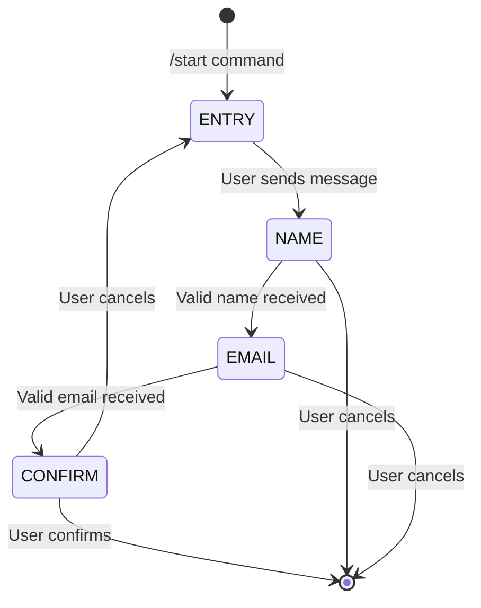
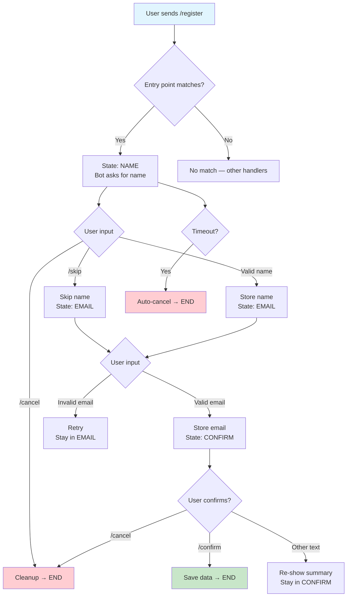

# Chapter 7: ConversationHandler (Multi-Step Dialogs)

## Overview

Most non-trivial bot interactions span multiple messages: a user registration flow, an order wizard, a survey, or a support ticket. Without explicit state tracking, your bot treats every incoming message as independent — it has no memory of what step the user is on.

`ConversationHandler` solves this by implementing a **finite state machine** that tracks per-user (and optionally per-chat) state across messages. It routes incoming updates to the correct handler based on the current state, and automatically transitions between states based on handler return values.

> [!NOTE]
> `ConversationHandler` is part of `python-telegram-bot`'s `ext` module. It is not a core Telegram API feature — it is an application-level abstraction provided by the library.

**When to use `ConversationHandler`:**

| Scenario | Recommended Approach |
|----------|---------------------|
| Single-step command with optional follow-up | Manual `context.user_data` tracking |
| 2–3 step input collection (e.g., name → email) | `ConversationHandler` |
| Complex wizards with branching logic | `ConversationHandler` with nested handlers |
| State that must survive bot restarts | `ConversationHandler` with `persistent=True` |
| Highly dynamic state graphs | Manual state machine (custom implementation) |

### Core Concepts



A `ConversationHandler` manages four components:

1. **Entry Points** — Handlers that *start* the conversation. When a matching update arrives and no conversation is active, the handler fires and transitions to the first state.

2. **States** — A dictionary mapping state constants to lists of handlers. When a conversation is active, the handler registered for the current state processes the next update.

3. **Fallbacks** — Handlers that can interrupt the conversation from *any* state. Typically used for `/cancel`, `/help`, or error recovery.

4. **Per-user state tracking** — The handler internally maintains a mapping of `(user_id, chat_id, message_thread_id)` → current state, stored in `context.user_data` or a persistence backend.

---

## ConversationHandler Constructor

```python
from telegram.ext import ConversationHandler, CommandHandler, MessageHandler, filters

async def start(update, context):
    await update.message.reply_text("What is your name?")
    return NAME_STATE

async def get_name(update, context):
    context.user_data["name"] = update.message.text
    await update.message.reply_text("What is your email?")
    return EMAIL_STATE

async def get_email(update, context):
    context.user_data["email"] = update.message.text
    await update.message.reply_text("Registered!")
    return ConversationHandler.END

async def cancel(update, context):
    await update.message.reply_text("Cancelled.")
    return ConversationHandler.END

conv_handler = ConversationHandler(
    entry_points=[CommandHandler("register", start)],
    states={
        NAME_STATE: [MessageHandler(filters.TEXT & ~filters.COMMAND, get_name)],
        EMAIL_STATE: [MessageHandler(filters.TEXT & ~filters.COMMAND, get_email)],
    },
    fallbacks=[CommandHandler("cancel", cancel)],
    per_user=True,
    per_chat=False,
    per_message=False,
    conversation_timeout=300,
    name="registration",
    persistent=True,
)
```

---

## Detailed Parameters

| Parameter | Type | Default | Description |
|-----------|------|---------|-------------|
| `entry_points` | `list[Handler]` | **Required** | Handlers that can start a new conversation. |
| `states` | `dict[int \| str \| Enum, list[Handler]]` | **Required** | Maps each state to its handlers. |
| `fallbacks` | `list[Handler]` | `[]` | Handlers that fire from any state (e.g., `/cancel`). |
| `per_user` | `bool` | `True` | Track state per user. Each user has their own conversation. |
| `per_chat` | `bool` | `False` | Track state per chat. One conversation per group. |
| `per_message` | `bool` | `False` | Track state per message. Required for `CallbackQueryHandler` entry points without `pattern`. |
| `conversation_timeout` | `int \| float \| None` | `None` | Seconds before the conversation auto-cancels. `None` = no timeout. |
| `name` | `str \| None` | `None` | Unique name for persistence. Required when `persistent=True`. |
| `persistent` | `bool` | `False` | Persist state across bot restarts via `PicklePersistence` or `JSONPersistence`. |
| `map_to_parent` | `dict[int \| str, int \| str]` | `{}` | Map states to parent conversation states (for nested conversations). |
| `block` | `bool` | `True` | Whether this handler blocks other handlers from processing the same update. |

### Behavior Flags Explained

**`per_user`** — The default. Each user gets their own conversation state. Two users in the same group can be in different states simultaneously.

**`per_chat`** — Each chat (group/channel) shares one conversation state. Useful for group-only bots where all users collaborate on the same flow.

**`per_message`** — Required when using `CallbackQueryHandler` as an entry point *without* a `pattern` argument. Each message gets its own conversation, allowing multiple concurrent inline-keyboard-driven conversations.

> [!CAUTION]
> Setting `per_message=True` means each message spawns a separate conversation. This is memory-intensive in high-traffic bots. Always prefer `pattern` filtering on `CallbackQueryHandler` to avoid this.

**`map_to_parent`** — Enables nested conversations. When a sub-conversation reaches a mapped state, control returns to the parent conversation at the mapped state:

```python
MAIN, SUB_CONVERSATION = range(2)
SUB_START, SUB_STATE1, SUB_STATE2 = range(3)

sub_conv = ConversationHandler(
    entry_points=[CommandHandler("sub", sub_start)],
    states={
        SUB_STATE1: [MessageHandler(filters.TEXT, sub_state1)],
        SUB_STATE2: [MessageHandler(filters.TEXT, sub_state2)],
    },
    fallbacks=[CommandHandler("cancel", sub_cancel)],
    map_to_parent={
        ConversationHandler.END: MAIN,  # Return to main when sub ends
    },
)

main_conv = ConversationHandler(
    entry_points=[CommandHandler("start", main_start)],
    states={
        MAIN: [sub_conv],
    },
    fallbacks=[CommandHandler("cancel", main_cancel)],
)
```

---

## State Definition Patterns

### Using `range()` for Numbered States

Simple and conventional for linear flows:

```python
from telegram.ext import ConversationHandler

NAME, EMAIL, CONFIRM = range(3)
```

### Using `Enum` for Named States

Self-documenting and type-safe:

```python
import enum

class RegistrationState(enum.Enum):
    NAME = "name"
    EMAIL = "email"
    CONFIRM = "confirm"

conv_handler = ConversationHandler(
    entry_points=[CommandHandler("register", start)],
    states={
        RegistrationState.NAME: [MessageHandler(filters.TEXT, get_name)],
        RegistrationState.EMAIL: [MessageHandler(filters.TEXT, get_email)],
        RegistrationState.CONFIRM: [MessageHandler(filters.TEXT, confirm)],
    },
    fallbacks=[CommandHandler("cancel", cancel)],
)
```

### String-Based States

Useful when states are dynamic or loaded from configuration:

```python
states = {
    "awaiting_name": [MessageHandler(filters.TEXT, get_name)],
    "awaiting_email": [MessageHandler(filters.TEXT, get_email)],
}
```

> [!TIP]
> `Enum`-based states are recommended for production code. They provide IDE autocomplete, prevent typos, and make state transitions explicit in type checkers.

---

## Complete Examples

### Registration Flow

A multi-step registration with input validation and skip support:

```python
import logging
import re
from telegram import ReplyKeyboardRemove, Update
from telegram.ext import (
    CallbackContext,
    CommandHandler,
    ConversationHandler,
    MessageHandler,
    filters,
)

logger = logging.getLogger(__name__)

NAME, EMAIL, PHONE, CONFIRM = range(4)

EMAIL_RE = re.compile(r"^[a-zA-Z0-9_.+-]+@[a-zA-Z0-9-]+\.[a-zA-Z0-9-.]+$")
PHONE_RE = re.compile(r"^\+?\d{7,15}$")


async def register_start(update: Update, context: CallbackContext) -> int:
    """Entry point: ask for the user's name."""
    await update.message.reply_text(
        "Let's get you registered!\n\n"
        "What is your full name?\n"
        "(Send /skip to skip this step, /cancel to abort.)",
        reply_markup=ReplyKeyboardRemove(),
    )
    return NAME


async def get_name(update: Update, context: CallbackContext) -> int:
    """Receive the name and ask for email."""
    name = update.message.text.strip()
    if len(name) < 2:
        await update.message.reply_text("Name must be at least 2 characters. Try again:")
        return NAME

    context.user_data["name"] = name
    await update.message.reply_text(
        f"Nice to meet you, {name}!\n\nWhat is your email address?"
    )
    return EMAIL


async def skip_name(update: Update, context: CallbackContext) -> int:
    """Skip the name step."""
    context.user_data["name"] = None
    await update.message.reply_text("OK, skipping name.\nWhat is your email address?")
    return EMAIL


async def get_email(update: Update, context: CallbackContext) -> int:
    """Receive the email and ask for phone."""
    email = update.message.text.strip()
    if not EMAIL_RE.match(email):
        await update.message.reply_text("That doesn't look like a valid email. Try again:")
        return EMAIL

    context.user_data["email"] = email
    await update.message.reply_text("Got it!\nWhat is your phone number?\n(Send /skip to skip.)")
    return PHONE


async def get_phone(update: Update, context: CallbackContext) -> int:
    """Receive the phone number."""
    phone = update.message.text.strip()
    if not PHONE_RE.match(phone):
        await update.message.reply_text(
            "Invalid phone number. Use international format (e.g., +1234567890). Try again:"
        )
        return PHONE

    context.user_data["phone"] = phone
    return await show_confirmation(update, context)


async def skip_phone(update: Update, context: CallbackContext) -> int:
    """Skip the phone step."""
    context.user_data["phone"] = None
    return await show_confirmation(update, context)


async def show_confirmation(update: Update, context: CallbackContext) -> int:
    """Show a summary and ask for confirmation."""
    data = context.user_data
    summary = (
        "Please confirm your registration:\n\n"
        f"  Name:  {data.get('name') or '(skipped)'}\n"
        f"  Email: {data.get('email')}\n"
        f"  Phone: {data.get('phone') or '(skipped)'}\n\n"
        "Send /confirm to complete, /cancel to abort, or any text to edit."
    )
    await update.message.reply_text(summary)
    return CONFIRM


async def confirm_registration(update: Update, context: CallbackContext) -> int:
    """Finalize the registration."""
    logger.info(
        "Registration completed for user %s: %s",
        update.effective_user.id,
        context.user_data,
    )
    await update.message.reply_text("Registration complete! 🎉")
    context.user_data.clear()
    return ConversationHandler.END


async def cancel(update: Update, context: CallbackContext) -> int:
    """Cancel the conversation."""
    await update.message.reply_text("Registration cancelled.", reply_markup=ReplyKeyboardRemove())
    context.user_data.clear()
    return ConversationHandler.END


registration_handler = ConversationHandler(
    entry_points=[CommandHandler("register", register_start)],
    states={
        NAME: [
            MessageHandler(filters.TEXT & ~filters.COMMAND, get_name),
            CommandHandler("skip", skip_name),
        ],
        EMAIL: [MessageHandler(filters.TEXT & ~filters.COMMAND, get_email)],
        PHONE: [
            MessageHandler(filters.TEXT & ~filters.COMMAND, get_phone),
            CommandHandler("skip", skip_phone),
        ],
        CONFIRM: [
            CommandHandler("confirm", confirm_registration),
            MessageHandler(filters.TEXT, show_confirmation),  # Re-show summary on any text
        ],
    },
    fallbacks=[CommandHandler("cancel", cancel)],
    per_user=True,
    conversation_timeout=600,
    name="registration",
    persistent=True,
)
```

### Order Flow with Inline Keyboards

Using `CallbackQueryHandler` within conversation states:

```python
import enum
import logging
from telegram import InlineKeyboardButton, InlineKeyboardMarkup, Update
from telegram.ext import (
    CallbackQueryHandler,
    CommandHandler,
    ConversationHandler,
    ContextTypes,
    MessageHandler,
    filters,
)

logger = logging.getLogger(__name__)


class OrderState(enum.Enum):
    SELECT_PRODUCT = "select_product"
    SELECT_QUANTITY = "select_quantity"
    CONFIRM = "confirm"


PRODUCTS = {"laptop": "Laptop — $999", "phone": "Phone — $699", "tablet": "Tablet — $449"}


def product_keyboard() -> InlineKeyboardMarkup:
    return InlineKeyboardMarkup([
        [InlineKeyboardButton(name, callback_data=f"product:{pid}")]
        for pid, name in PRODUCTS.items()
    ])


def quantity_keyboard() -> InlineKeyboardMarkup:
    return InlineKeyboardMarkup([
        [
            InlineKeyboardButton("1", callback_data="qty:1"),
            InlineKeyboardButton("2", callback_data="qty:2"),
            InlineKeyboardButton("3", callback_data="qty:3"),
        ],
        [InlineKeyboardButton("← Back", callback_data="back:products")],
    ])


def confirm_keyboard() -> InlineKeyboardMarkup:
    return InlineKeyboardMarkup([
        [
            InlineKeyboardButton("✅ Place Order", callback_data="order:confirm"),
            InlineKeyboardButton("❌ Cancel", callback_data="order:cancel"),
        ]
    ])


async def start_order(update: Update, context: ContextTypes.DEFAULT_TYPE) -> int:
    await update.message.reply_text(
        "What would you like to order?",
        reply_markup=product_keyboard(),
    )
    return OrderState.SELECT_PRODUCT


async def select_product(update: Update, context: ContextTypes.DEFAULT_TYPE) -> int:
    query = update.callback_query
    await query.answer()

    data = query.data
    if data.startswith("product:"):
        product_id = data.split(":", 1)[1]
        context.user_data["product"] = product_id
        await query.edit_message_text(
            f"You selected: {PRODUCTS[product_id]}\n\nHow many?",
            reply_markup=quantity_keyboard(),
        )
        return OrderState.SELECT_QUANTITY

    return OrderState.SELECT_PRODUCT


async def select_quantity(update: Update, context: ContextTypes.DEFAULT_TYPE) -> int:
    query = update.callback_query
    await query.answer()

    data = query.data
    if data == "back:products":
        await query.edit_message_text(
            "What would you like to order?",
            reply_markup=product_keyboard(),
        )
        return OrderState.SELECT_PRODUCT

    if data.startswith("qty:"):
        qty = int(data.split(":", 1)[1])
        context.user_data["quantity"] = qty

        product = PRODUCTS[context.user_data["product"]]
        await query.edit_message_text(
            f"Order Summary:\n\n"
            f"  Product: {product}\n"
            f"  Quantity: {qty}\n"
            f"  Total: ${qty * _get_price(context.user_data['product']):,}\n\n"
            f"Confirm your order?",
            reply_markup=confirm_keyboard(),
        )
        return OrderState.CONFIRM

    return OrderState.SELECT_QUANTITY


def _get_price(product_id: str) -> int:
    prices = {"laptop": 999, "phone": 699, "tablet": 449}
    return prices.get(product_id, 0)


async def confirm_order(update: Update, context: ContextTypes.DEFAULT_TYPE) -> int:
    query = update.callback_query
    await query.answer()

    if query.data == "order:confirm":
        logger.info(
            "Order placed by user %s: %s",
            query.from_user.id,
            context.user_data,
        )
        await query.edit_message_text("Order placed successfully! 🎉")
    else:
        await query.edit_message_text("Order cancelled.")

    context.user_data.clear()
    return ConversationHandler.END


async def cancel_order(update: Update, context: ContextTypes.DEFAULT_TYPE) -> int:
    await update.message.reply_text("Order cancelled.")
    context.user_data.clear()
    return ConversationHandler.END


order_handler = ConversationHandler(
    entry_points=[CommandHandler("order", start_order)],
    states={
        OrderState.SELECT_PRODUCT: [
            CallbackQueryHandler(select_product, pattern=r"^product:"),
        ],
        OrderState.SELECT_QUANTITY: [
            CallbackQueryHandler(select_quantity, pattern=r"^(qty:|back:)"),
        ],
        OrderState.CONFIRM: [
            CallbackQueryHandler(confirm_order, pattern=r"^order:"),
        ],
    },
    fallbacks=[CommandHandler("cancel", cancel_order)],
    per_user=True,
    per_message=False,
    name="order",
    persistent=True,
)
```

### Nested Conversations

A parent conversation that delegates to sub-conversations:

```python
import logging
from telegram import Update
from telegram.ext import (
    CallbackContext,
    CommandHandler,
    ConversationHandler,
    MessageHandler,
    filters,
)

logger = logging.getLogger(__name__)

# Parent states
MAIN_MENU, IN_SETTINGS, IN_PROFILE = range(3)

# Settings sub-conversation states
SETTING_LANG, SETTING_THEME = range(10, 12)

# Profile sub-conversation states
PROFILE_NAME, PROFILE_BIO = range(20, 22)


# ── Settings sub-conversation ────────────────────────────────

async def enter_settings(update: Update, context: CallbackContext) -> int:
    await update.message.reply_text("Settings > Language? (type a language code)")
    return SETTING_LANG


async def get_language(update: Update, context: CallbackContext) -> int:
    context.user_data["language"] = update.message.text
    await update.message.reply_text("Settings > Theme? (light/dark)")
    return SETTING_THEME


async def get_theme(update: Update, context: CallbackContext) -> int:
    context.user_data["theme"] = update.message.text
    await update.message.reply_text("Settings saved!")
    return ConversationHandler.END  # Returns to parent via map_to_parent


settings_conv = ConversationHandler(
    entry_points=[CommandHandler("settings", enter_settings)],
    states={
        SETTING_LANG: [MessageHandler(filters.TEXT & ~filters.COMMAND, get_language)],
        SETTING_THEME: [MessageHandler(filters.TEXT & ~filters.COMMAND, get_theme)],
    },
    fallbacks=[CommandHandler("cancel", lambda u, c: ConversationHandler.END)],
    map_to_parent={
        ConversationHandler.END: MAIN_MENU,
    },
)


# ── Profile sub-conversation ─────────────────────────────────

async def enter_profile(update: Update, context: CallbackContext) -> int:
    await update.message.reply_text("Profile > Name?")
    return PROFILE_NAME


async def get_profile_name(update: Update, context: CallbackContext) -> int:
    context.user_data["profile_name"] = update.message.text
    await update.message.reply_text("Profile > Bio?")
    return PROFILE_BIO


async def get_profile_bio(update: Update, context: CallbackContext) -> int:
    context.user_data["profile_bio"] = update.message.text
    await update.message.reply_text("Profile updated!")
    return ConversationHandler.END


profile_conv = ConversationHandler(
    entry_points=[CommandHandler("profile", enter_profile)],
    states={
        PROFILE_NAME: [MessageHandler(filters.TEXT & ~filters.COMMAND, get_profile_name)],
        PROFILE_BIO: [MessageHandler(filters.TEXT & ~filters.COMMAND, get_profile_bio)],
    },
    fallbacks=[CommandHandler("cancel", lambda u, c: ConversationHandler.END)],
    map_to_parent={
        ConversationHandler.END: MAIN_MENU,
    },
)


# ── Parent conversation ──────────────────────────────────────

async def main_menu(update: Update, context: CallbackContext) -> int:
    await update.message.reply_text(
        "Main menu:\n/settings - Configure settings\n/profile - Edit profile\n/cancel - Exit"
    )
    return MAIN_MENU


async def handle_main(update: Update, context: CallbackContext) -> int:
    text = update.message.text.lower()
    if "setting" in text:
        return IN_SETTINGS  # Transitions into settings_conv
    elif "profile" in text:
        return IN_PROFILE  # Transitions into profile_conv
    await update.message.reply_text("Unknown option. Try /settings or /profile.")
    return MAIN_MENU


main_handler = ConversationHandler(
    entry_points=[CommandHandler("start", main_menu)],
    states={
        MAIN_MENU: [
            settings_conv,
            profile_conv,
            MessageHandler(filters.TEXT & ~filters.COMMAND, handle_main),
        ],
    },
    fallbacks=[CommandHandler("cancel", lambda u, c: ConversationHandler.END)],
    per_user=True,
    name="main",
    persistent=True,
)
```

> [!NOTE]
> Sub-conversations are registered as regular handlers in the parent's `states` dict. When the sub-conversation reaches `ConversationHandler.END` and `map_to_parent` maps that to a parent state, execution resumes in the parent.

### Persistent Conversations (Survive Bot Restarts)

```python
from telegram.ext import ApplicationBuilder, PicklePersistence

async def post_init(application: ApplicationBuilder) -> None:
    """Called after persistence is loaded. Resume pending conversations."""
    pass


def main() -> None:
    persistence = PicklePersistence(filepath="bot_persistence.pkl")
    application = (
        ApplicationBuilder()
        .token("YOUR_BOT_TOKEN")
        .persistence(persistence)
        .post_init(post_init)
        .build()
    )

    application.add_handler(registration_handler)
    application.add_handler(order_handler)

    application.run_polling(allowed_updates=["message", "callback_query"])
```

> [!IMPORTANT]
> When `persistent=True`, the `name` parameter **must** be set to a unique string. This name is used as the key in the persistence backend. Two `ConversationHandler` instances with the same `name` will conflict.

---

## Common Patterns

### Skip Steps with `/skip`

Allow users to skip optional fields:

```python
async def skip_handler(update: Update, context: CallbackContext) -> int:
    """Generic skip handler — works for any optional step."""
    context.user_data[f"skipped_{context.user_data.get('_current_step')}"] = True
    await update.message.reply_text("Skipped.")
    return _next_state(context)
```

Or register `CommandHandler("skip", ...)` in each state's handler list alongside the main input handler.

### Timeout Handling

When `conversation_timeout` is set, the conversation auto-cancels after the specified duration. Handle this gracefully:

```python
from telegram.ext import ConversationHandler, MessageHandler, filters

conv_handler = ConversationHandler(
    entry_points=[CommandHandler("start", start)],
    states={
        NAME: [MessageHandler(filters.TEXT & ~filters.COMMAND, get_name)],
    },
    fallbacks=[CommandHandler("cancel", cancel)],
    conversation_timeout=300,  # 5 minutes
)

# To handle timeout callbacks, use Application.bot_data or a custom callback:
async def handle_timeout(update: Update, context: CallbackContext) -> None:
    """Called when a conversation times out."""
    if update.message:
        await update.message.reply_text("Session timed out. Send /start to begin again.")
```

> [!NOTE]
> `ConversationHandler` does not provide a built-in timeout callback. When a timeout occurs, the handler is silently removed and the next update starts a fresh conversation. To notify the user, you can subclass `ConversationHandler` or use `Application.job_queue` to schedule timeout warnings.

### Restart from Any State

Provide a global restart command in fallbacks:

```python
async def restart(update: Update, context: CallbackContext) -> int:
    """Cancel current conversation and start fresh."""
    context.user_data.clear()
    await update.message.reply_text("Starting over…")
    return await start(update, context)  # Re-enter the first state
    # Note: this only works if start() returns the entry state correctly.
    # Alternatively, return the first state constant directly.

conv_handler = ConversationHandler(
    entry_points=[CommandHandler("start", start)],
    states={...},
    fallbacks=[
        CommandHandler("cancel", cancel),
        CommandHandler("restart", restart),
    ],
)
```

---

## Common Mistakes

### 1. Forgetting to Return the Next State

```python
# ❌ WRONG — conversation gets stuck
async def get_name(update, context):
    context.user_data["name"] = update.message.text
    await update.message.reply_text("What is your email?")

# ✅ CORRECT
async def get_name(update, context):
    context.user_data["name"] = update.message.text
    await update.message.reply_text("What is your email?")
    return EMAIL_STATE
```

> [!CAUTION]
> If a handler returns `None`, the `ConversationHandler` keeps the user in the *current* state. This is often a source of bugs where users appear "stuck."

### 2. Not Handling `ConversationHandler.END`

Every terminal handler must explicitly return `ConversationHandler.END` to clean up state:

```python
# ❌ WRONG — state is never cleaned up
async def done(update, context):
    await update.message.reply_text("Done!")

# ✅ CORRECT
async def done(update, context):
    await update.message.reply_text("Done!")
    context.user_data.clear()
    return ConversationHandler.END
```

### 3. Blocking Issues with `per_message=True`

When `per_message=True` and `per_user=True` (the default), every message from every user in every chat creates a separate conversation. This can exhaust memory in groups with many users. Use `per_message=True` only when you have multiple concurrent inline-keyboard conversations on the same message from different users.

### 4. Conversation State Conflicts

Two `ConversationHandler` instances with the same `name` but different state definitions will corrupt each other's state when using persistence. Always use unique names.

### 5. Missing `~filters.COMMAND` in Text Handlers

```python
# ❌ WRONG — catches /cancel, /help, etc., breaking fallbacks
states={
    NAME: [MessageHandler(filters.TEXT, get_name)],
}

# ✅ CORRECT — lets commands fall through to fallbacks
states={
    NAME: [MessageHandler(filters.TEXT & ~filters.COMMAND, get_name)],
}
```

> [!IMPORTANT]
> Always exclude `filters.COMMAND` from text handlers within conversation states. Otherwise, slash commands like `/cancel` will be consumed by the state handler instead of reaching fallbacks.

---

## Mermaid: Complete Conversation Flow


