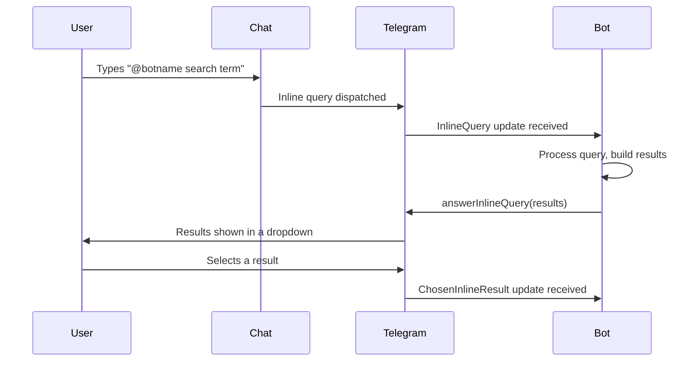
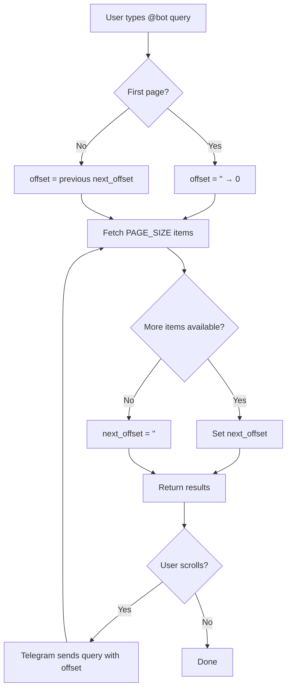

# Chapter 10: Inline Mode

## Overview

Inline mode allows users to interact with your bot **from any chat** — group, private, or channel — by typing `@botname query` in the message input field. The bot responds with results that are rendered directly in the chat without opening a separate conversation.

This is one of the most powerful features for building utility bots: search engines, translators, content generators, and quick-access tools that users can invoke without ever leaving their current conversation.

### How It Works



### Enabling Inline Mode

1. Open a chat with **@BotFather**.
2. Send `/mybots` and select your bot.
3. Choose **Bot Settings** → **Inline Mode** → **Turn on**.
4. Optionally set a placeholder text that appears when the user types `@botname` with no query.

> [!NOTE]
> Inline mode requires your bot to receive updates. Ensure you have either a webhook or polling configured and that the `InlineQueryHandler` is registered in your application.

### Use Cases

| Use Case | Example |
|---|---|
| **Search** | Query a product catalog, knowledge base, or meme database |
| **Translation** | Type text to translate, receive translated results inline |
| **Content generation** | Generate QR codes, color palettes, unit conversions |
| **Quick tools** | Calculators, timers, reminders that resolve instantly |
| **Sticker/emoji packs** | Browse and send stickers from a custom collection |

---

## InlineQueryHandler

### Registering the Handler

```python
from telegram import Update
from telegram.ext import ApplicationBuilder, InlineQueryHandler, ContextTypes


async def inline_query_handler(
    update: Update, context: ContextTypes.DEFAULT_TYPE
) -> None:
    """Handle incoming inline queries."""
    query = update.inline_query.query
    user = update.inline_query.from_user
    # ... process and answer
    pass


app = ApplicationBuilder().token("BOT_TOKEN").build()
app.add_handler(InlineQueryHandler(inline_query_handler))
```

### Accessing Query Data

The `InlineQuery` object provides:

| Property | Type | Description |
|---|---|---|
| `update.inline_query.query` | `str` | The text the user typed after `@botname` |
| `update.inline_query.from_user` | `User` | The user who sent the query |
| `update.inline_query.offset` | `str` | Pagination offset (empty string for first page) |
| `update.inline_query.location` | `Location \| None` | User's location (if shared) |
| `update.inline_query.chat_type` | `str \| None` | Type of chat: `sender`, `private`, `group`, `supergroup`, `channel` |
| `update.inline_query.id` | `str` | Unique query ID for answering |

### Query Offset for Pagination

The `offset` field is a string managed by Telegram. Your first query receives an empty string. When you return results, you set `next_offset` to tell Telegram what to pass on the next page. The next page is requested when the user scrolls past all current results.

```python
async def paginated_inline(update: Update, context: ContextTypes.DEFAULT_TYPE) -> None:
    offset = update.inline_query.offset or "0"
    page_size = 10
    start = int(offset)

    results = fetch_results(start, page_size)

    next_offset = str(start + page_size) if len(results) == page_size else ""

    await update.inline_query.answer(
        results=results,
        next_offset=next_offset,
    )
```

---

## InlineQueryResult Types

All result types are imported from `telegram.InlineQueryResult*`. Every result **must** have a unique `id` and an `input_message_content` (or `input_keyboard_content` for keyboard results).

### Article (Most Common)

The most flexible result type — renders as a rich message card with title, description, and thumbnail.

```python
from telegram import (
    InlineQueryResultArticle,
    InputTextMessageContent,
    InlineKeyboardMarkup,
    InlineKeyboardButton,
)

result = InlineQueryResultArticle(
    id="result_1",
    title="Python Documentation",
    description="Official Python docs — search for any topic",
    input_message_content=InputTextMessageContent(
        message_text="📘 Here's the Python docs for your query:\nhttps://docs.python.org/3/",
        parse_mode="Markdown",
        disable_web_page_preview=True,
    ),
    thumb_url="https://example.com/python-icon.png",
    thumb_width=48,
    thumb_height=48,
    reply_markup=InlineKeyboardMarkup(
        [[InlineKeyboardButton("Open Docs", url="https://docs.python.org/3/")]]
    ),
)
```

| Parameter | Required | Description |
|---|---|---|
| `id` | ✅ | Unique identifier for this result |
| `title` | ✅ | Title of the result |
| `input_message_content` | ✅ | Content sent when user selects this result |
| `description` | ❌ | Short description (1-100 chars recommended) |
| `thumb_url` | ❌ | Thumbnail URL (96×96 recommended) |
| `thumb_width` | ❌ | Thumbnail width in pixels |
| `thumb_height` | ❌ | Thumbnail height in pixels |
| `reply_markup` | ❌ | Inline keyboard attached to the message |
| `parse_mode` | ❌ | `HTML` or `MarkdownV2` for title/description |
| `hide_url` | ❌ | Hide the URL below the title |

### Photo

Displays a photo result. Each result is a single photo — use a `Group` for albums.

```python
from telegram import InlineQueryResultPhoto

result = InlineQueryResultPhoto(
    id="photo_1",
    photo_url="https://example.com/photo.jpg",
    thumb_url="https://example.com/photo-thumb.jpg",
    caption="A beautiful sunset",
    parse_mode="HTML",
)
```

| Parameter | Required | Description |
|---|---|---|
| `id` | ✅ | Unique identifier |
| `photo_url` | ✅ | URL of the photo |
| `thumb_url` | ✅ | URL of the thumbnail |
| `caption` | ❌ | Photo caption (0-1024 chars) |
| `parse_mode` | ❌ | `HTML` or `MarkdownV2` |
| `description` | ❌ | Short description shown below the title |

### GIF / MPEG4 GIF

Animated results. `Mpeg4Gif` supports H.264/MPEG-4 AVC video notes.

```python
from telegram import InlineQueryResultGif, InlineQueryResultMpeg4Gif

gif = InlineQueryResultGif(
    id="gif_1",
    gif_url="https://example.com/animation.gif",
    thumb_url="https://example.com/animation-thumb.gif",
    caption="Check this out!",
)

mpeg4 = InlineQueryResultMpeg4Gif(
    id="mpeg4_1",
    mpeg4_url="https://example.com/video.mp4",
    thumb_url="https://example.com/video-thumb.gif",
    caption="Short video clip",
)
```

### Video

Inline video results with title and duration.

```python
from telegram import InlineQueryResultVideo

result = InlineQueryResultVideo(
    id="video_1",
    video_url="https://example.com/video.mp4",
    mime_type="video/mp4",
    thumb_url="https://example.com/video-thumb.jpg",
    title="Tutorial Video",
    description="A 5-minute tutorial",
    video_duration=300,
    caption="Watch this tutorial",
)
```

### Audio

Audio results with performer and duration metadata.

```python
from telegram import InlineQueryResultAudio

result = InlineQueryResultAudio(
    id="audio_1",
    audio_url="https://example.com/track.mp3",
    title="Cool Track",
    performer="Artist Name",
    audio_duration=210,
)
```

### Voice

Voice message results (OGG/OPUS).

```python
from telegram import InlineQueryResultVoice

result = InlineQueryResultVoice(
    id="voice_1",
    voice_url="https://example.com/voice.ogg",
    title="Voice Note",
    voice_duration=45,
)
```

### Document

File sharing results — appears as a downloadable attachment.

```python
from telegram import InlineQueryResultDocument

result = InlineQueryResultDocument(
    id="doc_1",
    document_url="https://example.com/report.pdf",
    title="Monthly Report",
    description="June 2026 report",
    mime_type="application/pdf",
    caption="Attached: Monthly Report (PDF)",
)
```

### Sticker

Inline sticker results from a sticker set.

```python
from telegram import InlineQueryResultSticker

result = InlineQueryResultSticker(
    id="sticker_1",
    sticker_file_id="FILE_ID_FROM_STICKER_SET",
    sticker_width=512,
    sticker_height=512,
)
```

### Location

Location results for geo-aware queries.

```python
from telegram import InlineQueryResultLocation

result = InlineQueryResultLocation(
    id="loc_1",
    latitude=40.7128,
    longitude=-74.0060,
    title="New York City",
    description="The Big Apple",
)
```

### Venue

Venue results (location + business info).

```python
from telegram import InlineQueryResultVenue

result = InlineQueryResultVenue(
    id="venue_1",
    latitude=48.8566,
    longitude=2.3522,
    title="Cafe de Flore",
    address="172 Bd Saint-Germain, 75006",
    google_place_id="ChIJRV0Z...",
    google_place_type="restaurant",
)
```

### Contact

Contact card results.

```python
from telegram import InlineQueryResultContact

result = InlineQueryResultContact(
    id="contact_1",
    phone_number="+1234567890",
    first_name="John",
    last_name="Doe",
    vcard="BEGIN:VCARD\nVERSION:3.0\nTEL:+1234567890\nEND:VCARD",
)
```

### Game

Game results — user selects and plays a game.

```python
from telegram import InlineQueryResultGame

result = InlineQueryResultGame(
    id="game_1",
    game_short_name="my_game",
)
```

> [!IMPORTANT]
> Games must be registered via @BotFather and your bot must implement the `GameQuery` callback to handle game-specific inline queries.

### Poll

Poll results displayed inline.

```python
from telegram import InlineQueryResultPoll

result = InlineQueryResultPoll(
    id="poll_1",
    question="What's your favorite language?",
    options=[
        InputPollOption(text="Python"),
        InputPollOption(text="JavaScript"),
        InputPollOption(text="Rust"),
    ],
    is_anonymous=True,
    type="quiz",
    correct_option_id=0,
)
```

---

## InputMessageContent

When a user selects an inline result, Telegram sends the content defined by `input_message_content` as a regular message. There are several types:

### InputTextMessageContent (Most Common)

Sends a text message when the result is selected.

```python
from telegram import InputTextMessageContent

content = InputTextMessageContent(
    message_text="Hello! You searched for: *query*",
    parse_mode="MarkdownV2",
    disable_web_page_preview=False,
)
```

| Parameter | Description |
|---|---|
| `message_text` | The message text (up to 4096 chars) |
| `parse_mode` | `HTML` or `MarkdownV2` |
| `disable_web_page_preview` | Disable link previews |

### InputLocationMessageContent

Sends a map with the specified location.

```python
from telegram import InputLocationMessageContent

content = InputLocationMessageContent(
    latitude=40.7128,
    longitude=-74.0060,
    horizontal_accuracy=10.0,  # in meters
)
```

### InputVenueMessageContent

Sends a venue (location with name and address).

```python
from telegram import InputVenueMessageContent

content = InputVenueMessageContent(
    latitude=48.8566,
    longitude=2.3522,
    title="Eiffel Tower",
    address="Champ de Mars, Paris",
    foursquare_id="4adcda09f964a520b22a20e3",
)
```

### InputContactMessageContent

Sends a contact card.

```python
from telegram import InputContactMessageContent

content = InputContactMessageContent(
    phone_number="+1234567890",
    first_name="Jane",
    last_name="Smith",
    vcard="BEGIN:VCARD\nVERSION:3.0\nTEL:+1234567890\nEND:VCARD",
)
```

### InputInvoiceMessageContent

Sends an invoice for Telegram Payments (stars or real currency).

```python
from telegram import InputInvoiceMessageContent

content = InputInvoiceMessageContent(
    title="Premium Subscription",
    description="1 month of premium features",
    payload="premium_monthly",
    provider_token="YOUR_PAYMENT_PROVIDER_TOKEN",
    currency="USD",
    prices=[LabeledPrice("Premium (1 month)", 999)],
    need_name=True,
    need_email=True,
)
```

> [!WARNING]
> `InputInvoiceMessageContent` requires the Telegram Payments API to be configured. Ensure you have a payment provider token from @BotFather.

---

## Answering Queries

The `answer` method is the core of inline mode — it responds to an inline query with a list of results.

### Method Signature

```python
await update.inline_query.answer(
    results: list[InlineQueryResult],
    cache_time: int = 300,
    is_personal: bool = False,
    next_offset: str = "",
    switch_pm_text: str = "",
    switch_pm_parameter: str = "",
)
```

### Parameters

| Parameter | Type | Default | Description |
|---|---|---|---|
| `results` | `list[InlineQueryResult]` | — | List of results (max 50 per call) |
| `cache_time` | `int` | `300` | Seconds to cache results on Telegram's servers |
| `is_personal` | `bool` | `False` | If `True`, results are per-user and not cached globally |
| `next_offset` | `str` | `""` | Offset for next page of results |
| `switch_pm_text` | `str` | `""` | Text for a button linking to `/start` |
| `switch_pm_parameter` | `str` | `""` | Deep link parameter passed to `/start` |

### Cache Behavior

```
cache_time=0   → No caching, every query hits your server
cache_time=300 → Default, Telegram caches results for 5 minutes
cache_time=86400 → Maximum useful caching (24 hours)
```

> [!TIP]
> For dynamic results (live data, user-specific searches), always set `cache_time=0` and `is_personal=True`. For static results (static lists, help text), use the default 300-second cache to reduce server load.

### Switch PM Button

When you set `switch_pm_text`, Telegram shows a "Start" button above the results. This is useful for guiding users to start a private conversation with your bot.

```python
await update.inline_query.answer(
    results=results,
    switch_pm_text="Configure search settings",
    switch_pm_parameter="inline_settings",
)
```

---

## Complete Example: Search Bot

A production-ready inline search bot with pagination, error handling, and logging.

```python
import logging
from typing import Optional

from telegram import (
    Bot,
    InlineQueryResultArticle,
    InputTextMessageContent,
    Update,
)
from telegram.ext import (
    Application,
    CommandHandler,
    ContextTypes,
    InlineQueryHandler,
)

logging.basicConfig(
    format="%(asctime)s - %(name)s - %(levelname)s - %(message)s",
    level=logging.INFO,
)
logger = logging.getLogger(__name__)

# Simulated database
DATABASE = [
    {"id": 1, "title": "Python Basics", "snippet": "Variables, loops, functions..."},
    {
        "id": 2,
        "title": "Advanced Python",
        "snippet": "Decorators, generators, async...",
    },
    {"id": 3, "title": "Python Web Dev", "snippet": "Django, Flask, FastAPI..."},
    {"id": 4, "title": "Python Testing", "snippet": "pytest, unittest, mocking..."},
    {
        "id": 5,
        "title": "Python Data Science",
        "snippet": "NumPy, Pandas, Matplotlib...",
    },
    {"id": 6, "title": "Python Async", "snippet": "asyncio, coroutines, tasks..."},
    {"id": 7, "title": "Python Packaging", "snippet": "pip, poetry, wheels..."},
    {"id": 8, "title": "Python Security", "snippet": "Cryptography, auth, OWASP..."},
    {"id": 9, "title": "Python DevOps", "snippet": "Docker, CI/CD, monitoring..."},
    {"id": 10, "title": "Python Mobile", "snippet": "Kivy, BeeWare, Buildozer..."},
    {"id": 11, "title": "Python ML", "snippet": "scikit-learn, TensorFlow..."},
    {"id": 12, "title": "Python Networking", "snippet": "sockets, requests, httpx..."},
]

PAGE_SIZE = 5


def search_database(query: str, offset: int, limit: int) -> list[dict]:
    """Search the database with pagination."""
    if not query:
        filtered = DATABASE
    else:
        query_lower = query.lower()
        filtered = [
            item
            for item in DATABASE
            if query_lower in item["title"].lower()
            or query_lower in item["snippet"].lower()
        ]
    return filtered[offset : offset + limit]


def build_results(items: list[dict]) -> list[InlineQueryResultArticle]:
    """Convert database items to inline results."""
    results = []
    for item in items:
        results.append(
            InlineQueryResultArticle(
                id=str(item["id"]),
                title=item["title"],
                description=item["snippet"],
                input_message_content=InputTextMessageContent(
                    message_text=(
                        f"*{item['title']}*\n\n{item['snippet']}\n\n"
                        f"Source: Python Dev Handbook"
                    ),
                    parse_mode="Markdown",
                    disable_web_page_preview=True,
                ),
            )
        )
    return results


async def start_command(update: Update, context: ContextTypes.DEFAULT_TYPE) -> None:
    """Handle /start command."""
    if context.args and context.args[0] == "inline_settings":
        await update.message.reply_text(
            "🔍 *Inline Search Settings*\n\n"
            "Type `@botname <query>` in any chat to search.",
            parse_mode="Markdown",
        )
    else:
        await update.message.reply_text(
            "👋 Welcome to the Search Bot!\n\n"
            "Use `@botname <query>` in any chat to search our database.",
            parse_mode="Markdown",
        )


async def inline_query_handler(
    update: Update, context: ContextTypes.DEFAULT_TYPE
) -> None:
    """Handle inline queries with pagination and error handling."""
    query = update.inline_query
    search_text = query.query.strip()
    offset = int(query.offset) if query.offset else 0
    user = query.from_user

    logger.info(
        "Inline query from %s (id=%d): '%s' (offset=%d)",
        user.full_name,
        user.id,
        search_text,
        offset,
    )

    try:
        items = search_database(search_text, offset, PAGE_SIZE)
        results = build_results(items)

        next_offset = str(offset + PAGE_SIZE) if len(items) == PAGE_SIZE else ""

        await query.answer(
            results=results,
            cache_time=30 if search_text else 300,
            is_personal=True,
            next_offset=next_offset,
            switch_pm_text="Start bot for full search",
            switch_pm_parameter="inline_settings",
        )

        logger.info(
            "Answered inline query with %d results (next_offset=%s)",
            len(results),
            next_offset or "none",
        )

    except Exception as e:
        logger.error("Error handling inline query: %s", e, exc_info=True)
        await query.answer(
            results=[],
            cache_time=0,
            switch_pm_text="⚠️ Error — try again",
            switch_pm_parameter="inline_settings",
        )


async def error_handler(update: object, context: ContextTypes.DEFAULT_TYPE) -> None:
    """Log errors."""
    logger.error("Exception while handling update: %s", context.error, exc_info=True)


def main() -> None:
    """Start the bot."""
    app = Application.builder().token("YOUR_BOT_TOKEN").build()

    app.add_handler(CommandHandler("start", start_command))
    app.add_handler(InlineQueryHandler(inline_query_handler))
    app.add_error_handler(error_handler)

    app.run_polling(allowed_updates=Update.ALL_TYPES)


if __name__ == "__main__":
    main()
```

### Pagination Flow



---

## Personal Results

Set `is_personal=True` to make results unique to each user. Telegram will not cache these results across users.

### Use Cases

- **Search history**: Show recently accessed items for the current user
- **User-specific data**: Personal bookmarks, favorites, or settings
- **Privacy-sensitive queries**: Results that should not be cached or shared

```python
async def personal_inline(update: Update, context: ContextTypes.DEFAULT_TYPE) -> None:
    user_id = update.inline_query.from_user.id
    user_history = await get_user_search_history(user_id)

    results = [
        InlineQueryResultArticle(
            id=str(item["id"]),
            title=item["query"],
            description=f"Searched {item['timestamp']}",
            input_message_content=InputTextMessageContent(
                message_text=f"Your recent search: {item['query']}"
            ),
        )
        for item in user_history[:50]
    ]

    await update.inline_query.answer(
        results=results,
        cache_time=0,  # No cache — always fresh
        is_personal=True,
    )
```

> [!NOTE]
> When `is_personal=True`, Telegram passes the user's ID with each subsequent query, ensuring fresh results every time. Combined with `cache_time=0`, this gives you full control over result generation.

---

## Location-Based Queries

If the user has shared their location with your bot and typed an inline query, you can access `update.inline_query.location` to provide proximity-based results.

### Accessing Location

```python
from telegram import InlineQueryResultArticle, InputTextMessageContent


async def location_inline(update: Update, context: ContextTypes.DEFAULT_TYPE) -> None:
    location = update.inline_query.location

    if location is None:
        await update.inline_query.answer(
            results=[],
            cache_time=0,
            switch_pm_text="Share location for nearby results",
            switch_pm_parameter="location_sharing",
        )
        return

    nearby = find_nearby_places(
        lat=location.latitude,
        lon=location.longitude,
        query=update.inline_query.query,
    )

    results = [
        InlineQueryResultArticle(
            id=place["id"],
            title=place["name"],
            description=f"{place['distance']:.1f} km away",
            input_message_content=InputTextMessageContent(
                message_text=(
                    f"📍 *{place['name']}*\n\n"
                    f"{place['address']}\n"
                    f"Distance: {place['distance']:.1f} km"
                ),
                parse_mode="Markdown",
            ),
        )
        for place in nearby
    ]

    await update.inline_query.answer(results=results, cache_time=60, is_personal=True)
```

### How Location Sharing Works

1. The user must **enable inline mode** for your bot and have previously shared their location with it.
2. The `location` field is `None` if the user has not shared their location.
3. When `location` is `None`, you can use `switch_pm_text` to prompt the user to share their location in a private chat.

> [!WARNING]
> Location data is only available for users who have explicitly shared their location with your bot in a private chat. Do not assume location data is always present — always handle the `None` case.
